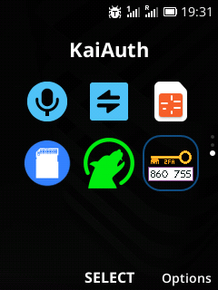
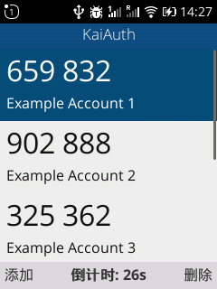
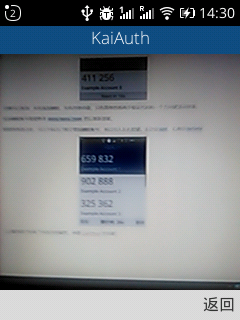

> KaiAuth is a simple alternative of Google Authenticator on KaiOS

I'm not a native speaker of English so there will be some mistakes in my sayings.

<!--more-->

# Install

## WebIDE
1. Download https://github.com/zjyl1994/KaiAuth/archive/master.zip .
1. Extract this zip to a folder.
1. Click "Open Packaged App" and select the folder from the previous step.
1. Click "Install and Run" button.

## OmniSD
1. Open https://github.com/zjyl1994/KaiAuth/releases/latest and download **kaiauth.zip**.
1. Copy this zip file to the apps directory of the memory card.
1. Open **OmniSD** and install this zip.

When you do the right thing by following the steps above,KaiAuth will appear in your phone menu.

# Use
## Basic functions

### Main interface

Although these screenshots are in Chinese, don't worry, English versions are now available.

You can see a lot of TOTP codes on the screen, you can use the navigation keys to scroll them up, down, left and right.

There are two soft keys at the bottom, the left one means to add a new code, and the right one means to delete the currently selected code.

Before deleting, you will be asked if you want to delete, so you do n’t need to worry about deleting an account profile mistakenly.

Press the soft key named Add on the left,the application will switch to the scan QR code page.

### Scan QR code interface

To use the QR-code scanning feature, the application requires permission for using the camera. A dialog will popup to ask you whether you are going to grant it or not.

Place the QR-code into the camera's sight. If any valid QR-codes are identified, the application will automatically extract information contained in the QR-code then generate a new profile from the information. The new profile will then be shown in the main interface of the app.

## Advanced Features

Based on what I actually need, I have made some advanced features. They can be activated by pressing keys in some special sequences.
Please enter these codes by sequence when you are opening KaiAuth. Entering these codes in the phone dialer has no effects at all.

### \*\#7370\#
Designed for very old Nokia phones. Will clean the data stored in the app. Very useful when you have messed up your code list and had to re-import the correct data.

### \*\#0000\#
Also useful when you are using an old Nokia. The version of the KaiAuth app will be shown after typing the sequence above.

### \*\#467678\#
Will automatically import profiles from a file `kaiauth.json` located in the SD card. Useful when you are transferring an existing profile list from another device, or restore profiles from a backup you previously made.

### \*\#397678\#
Will export current profiles stored in the application into a file named `kaiauth.json` in the SD card. Used for backing up or transferring profiles to a new device.

**WARNING:** The file contains sensitive information, please keep it in a safe place. Anyone who gets the file can get access to your account by using profiles stored in the file!

# Why i made it
I bought a Nokia 2720 Flip, which runs KaiOS. I have many accounts protected with Google Authenticator. I hope that I can still query these codes and log in to my account on my computer when I am away from my smartphone, so I go to the Internet to search for related tools.

Unfortunately, I didn't find related tools, some of them are only rough implementation of web pages, which need to use cursor to operate, which is very uncomfortable. Some don’t even have a basic feature to scan QR codes. It ’s very difficult to enter the two-step verification key accurately on the T9 keyboard of old phones. So I developed this KaiAuth myself, hoping that it can help someone who needs it.

If you like my work, please give me star on GitHub. https://github.com/zjyl1994/KaiAuth

Thanks for the help of Google Translate, I hope you can understand my bad English.

Finally, I would like to say great thanks for the correction on semantics and words to the article from [Carina Nebula](https://twitter.com/Carina__Nebula)!

Easter egg in logo: 86 is the international calling code of China, 0755 is the calling code of Shenzhen.