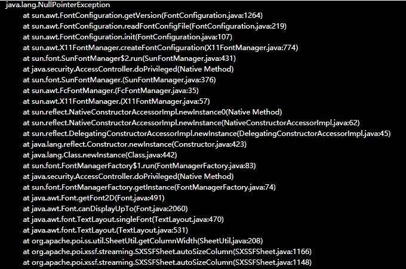

> 2019-02-11 农历己亥年上班第一天
> 
> 好久没有写博客了，我这个博客是Hugo静态编译的，写一次还是蛮复杂的，而且上班以后基本没有什么值得写的东西，所以博客基本都在长草。 
> 
> 立一个FLAG，2019 博客不长草。

# 前言

我现在的这家公司基本都在用现代化的开发工具，所有程序写完都在docker环境下运行，我们公司dalao钦定的底包就是alpine。后续的问题都是Alpine没有自带默认字体造成的。如果你想快速知道怎么解决请直接看最后。

# 问题

我遇到的问题是这样的：

`java.lang.NullPointerException at sun.awt.FontConfiguration.getVersion(FontConfiguration.java:1264)`



场景是公司买的快速开发框架jeeplus，自带一个数据导入功能，需要下载excel模板，当下载模板时触发NPE。

<!--more-->

# 追踪问题

要解决一个问题最好的办法就是去看调用栈。

通过看调用栈，我们可以知道问题出在Excel组件上。

Excel组件试图根据字体大小自动调整单元格宽度，当寻找fontconfig时发现根本找不到，返回一个Null。

拿着`java.lang.NullPointerException at sun.awt.FontConfiguration.getVersion(FontConfiguration.java:1264)`在谷歌搜索，可以看到很多github的issue，第一条连接 [NullPointerException in Alpine JRE 8 Font #73](https://github.com/docker-library/openjdk/issues/73) 就证明了我的猜想，确实是Alpine环境缺少对应的包。此问题影响所有使用官方Alpine的Java环境。

# 解决方案

在 Dockerfile 中进行修改，增加如下内容:

```dockerfile
ENV LANG en_US.UTF-8
RUN apk add --update ttf-dejavu fontconfig && rm -rf /var/cache/apk/*
```

通过添加fontconfig和一款字体dejavu，可以完美解决问题。

不过最好的方法还是封装一个镜像，替换掉官方的底包。流水线上每次打包都安装ttf-dejavu还是挺慢的。