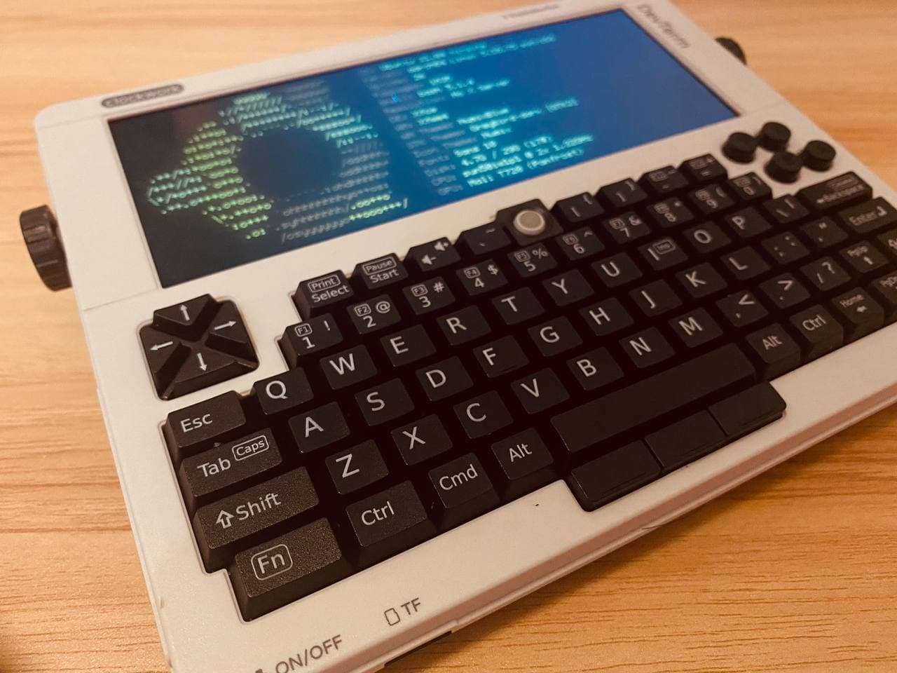
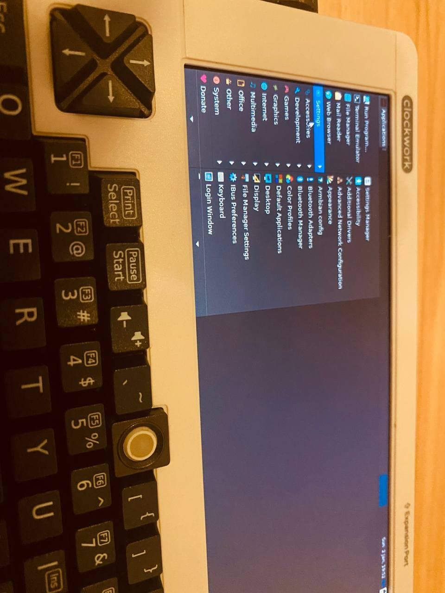

2020年11月，我在网上看到 ClockworkPi 发布的 DevTerm，在此之前我就听说过这家公司。
他家的 GameShell 之前就想买来着，但是1000多块买一个只能玩游戏的开源掌机实在下不去手。

2020年12月15号，我在激烈的思想斗争下下单了A04版本。还记得那个时候按照汇率差不多花了1700-1800左右。计划是拿来做一个打字机的，然后页面显示四月前交付，这是我第一次先款预购东西。

等到2021年3月多，情况有变，全球供应链紧张，论坛帖子发布更新状态，官网等待多天以后变成9月前交付。

持续等待后，9月，CM3版本交付了。那个时候我看到了少数的真机开箱视频，感觉有点小了。
然后10-11月A06交付了，只剩我这个A04用户持续等待。

2022年1月1日早晨，我收到了顺丰送来的 DevTerm。

<!--more-->

# 组装

组装 DevTerm 很简单，个人推荐弄一个水口剪。官方塑料件的质量非常之高，基本不需要打磨，只要用心剪就行了。包装里还有三根小螺丝，需要很小的一个十字螺丝刀，主要用途是固定核心板和主板。我没有找到能用的螺丝刀，也就没上，也没影响使用。用的接口是笔记本的DDR3接口，所以固定能力应该没有问题。

唯一的组装问题就是上面扩展插槽保护盖过于紧了，我用小锤子才敲进去，需要巧劲，一定要看前后翻看说明书再装。

个人觉得会出问题的地方。

1. 屏幕，网上蛮多人费劲把屏幕卡进去之后才发现接口没有对准留的位置，这个要注意一下。
1. WIFI天线，这个天线是贴在屏幕背板外侧的，我之前费力贴准到内侧，然后发现扣不上。
1. 顶部扩展口盖子，一定要看好官方的顺序，先插入左侧的，然后右侧敲进去，大力出奇迹。因为左侧是完整的柱状，右侧是倾斜一些的，所以一定要从右侧敲进去。

# 使用

## 更新镜像
A04的镜像是基于Armbian的，所以本质上还是个Debian，但是screenfetch的信息是Ubuntu，具体信息可以看头图。基于Debian，所以可以用apt去装你想要的软件包，deb之类的还算很流行。

拿到手首先需要更新版本，SD卡中安装的是第一代系统。官方的APT源放在Github上，如果你是国内用户再没有魔法手段的话，那你100%连不上，不用试了。我搞了个APT源的镜像，具体使用方法参考前面的博客。

```bash
sudo apt update && sudo apt install -y devterm-kernel-current-cpi-a04 devterm-gearbox-a04 devterm-fan-daemon-cpi-a04 && sudo reboot
```

更新系统，重启。

## 刷键盘固件
官方自带的轨迹球使用体验非常的差，尤其超宽屏横着滚需要滚一年。幸好有论坛大神搞了定制版固件，官方也非常迅速地采纳了优化，当你滚得速度快的时候鼠标移动会很多，再也不用一点一点搓过去了。

首先确定你有`/dev/ttyACM0`，如果没有多重启几次试试，只有这个在的时候才可以刷。

```bash
sudo apt install dfu-util -y

wget https://github.com/clockworkpi/DevTerm/raw/main/Code/devterm_keyboard/bin/DevTerm_keyboard_firmware_v0.3_utils.sh

chmod +x  DevTerm_keyboard_firmware_v0.3_utils.sh

sudo ./DevTerm_keyboard_firmware_v0.3_utils.sh
```
这些指令来自官方的论坛帖子，我自己试用过，效果提升巨大。
如果你在没有`/dev/ttyACM0`的时候就刷键盘固件，那你会得到一个失灵的键盘，别紧张长按电源键关机再开就好。

## 休眠

这个设备没有快速休眠按键，想休眠的话没法像笔记本一样合盖。所以可以使用`systemctl suspend`进行休眠，这样电池消耗会小一些。另外休眠以后键盘无法唤醒，可以通过轻按电源键唤醒。大概率是休眠期间给键盘断电了。

## 风扇

A04版本的风扇用的是GPIO进行控制，有一个Python写的风扇守护程序，温度超过66度的时候会转30秒进行降温，我个人觉得这个可以进行一些优化，首先代码层面，可以读写单独的配置文件，方便萌新来改，直接上手改Python，要不是我程序员出身可能就翻车了。

理论上操控风扇只需要三条指令

```bash
# 初始化GPIO
gpio mode 41 out
# 风扇转
gpio write 41 1
# 风扇关
gpio write 41 0
```

这个风扇逻辑也是有优化空间的，个人觉得可以弄成温度到多少的时候启动风扇直到某个温度值停止。现在这个启停逻辑只转30秒不太合适。这个小风扇持续转起来还是可以提供稳定降温的，55度吹一阵就可以变成49度。

# 总结
电池续航我买的松下电芯，现实7-8h，实际三小时多一些。浏览网页电跑的更快。

长按键除了空格手感都比较软，字母键倒是还可以，但是太小了，只能拿来双手举着打字。
不过这也解决了放在桌子上打字看屏幕累的问题。

armbian使用比较OK，但是桌面不能改壁纸，可能是我没找到地方，apt里软件还不少，但是少数需要自己编译。

如果你是拿来当打字机想做生产力工具的话还是算了，不如买个便宜的商务本把浏览器都删掉装个focuswriter。

如果你是拿来做玩具+大手办，还愿意花这么多钱，那完全OK。官方的质感做的很好，可惜ARM Linux不太适合一般人，最后只能做成极客的Cyberdeck。如果不会折腾的话还是去买GameShell之类的开箱即用玩具。

据说国内买这个的也就几十个人，大部分订单都是外国人订走了，希望他们可以玩出一些花来吧。

等我有空了再折腾折腾，到时候也给官方贡献一些代码。