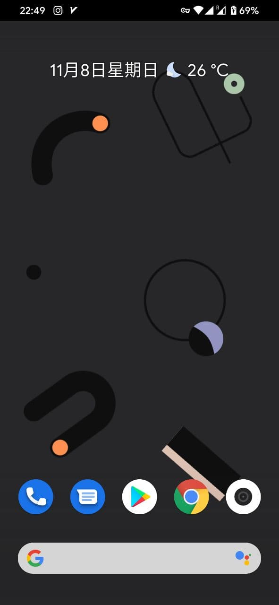
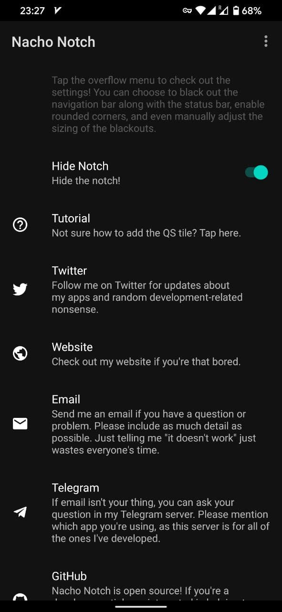
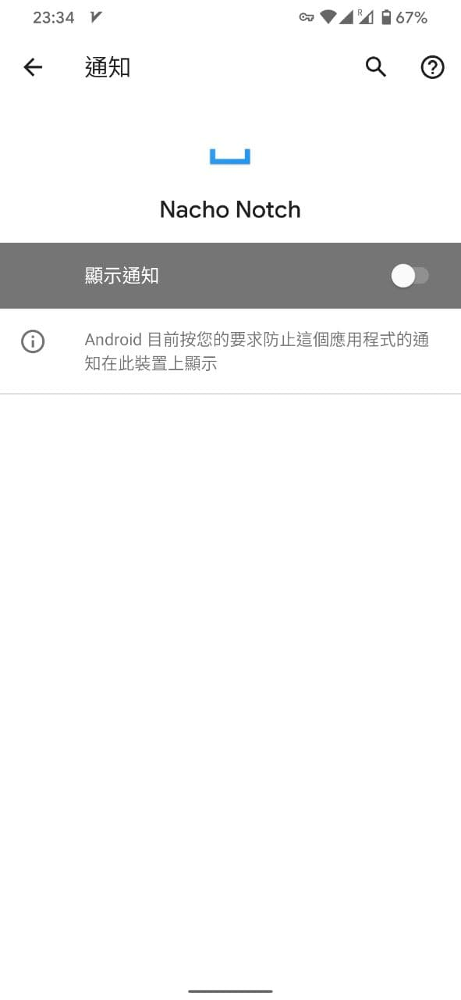
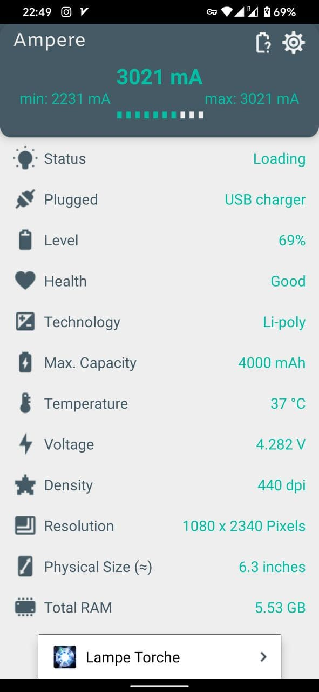

> 上班实在是忙，没时间折腾技术类的东西。
只能水一篇刷机笔记了，由于这篇实在太水了所以只能放生活分类。（尴尬

# 前言

之前为了刷机玩，买了一部红米的9A，想着就一个摄像头，什么奇怪没有的手机最适合刷机了，不用担心奇怪硬件造成的BUG，结果我想多了，MTK平台一个刷机包没有。这手机7月发布到现在连个第三方官改都找不到。

后来我就买了这部红米Note8，为了防止之前的教训，我特地去XDA围观了一下这部机的论坛，也看了几大著名的ROM，比如LineageOS、Pixel Experience、Resurrection Remix。他们都官方支持我这部手机，而且Xiaomi.eu也有最终的兜底方案，如果什么都刷不了我还有欧版可以刷，不用担心谷歌服务装不上。

# 刷机

买到手第一步就是申请解锁，小米解锁需要等待168小时，真是一分钟都少不了，在经历一整个星期的等待后，我解开了红米Note8的BL锁。

然后就是刷机，我当初选择了 Pixel Experience 作为首选，毕竟谷歌自己出的手机就是安卓标杆，照着改的第三方ROM准没有错。

标准的刷机流程就是，长按音量下+电源键开机进fastboot，然后用刷机命令刷最新的 `twrp recovery` 进去(文后有附地址)。

注意刷完了不要直接重启，关机，按住音量上+电源键开机直接进入 recovery，要不然你的twrp会被自带的官方rec覆盖掉。可能是小米自己的保护机制。

进入 recovery 就是install、wipe 然后reboot system。非常正常的刷机方法。

<!--more-->

等待开机的时候你需要准备一个魔法网络方便跳过开机的谷歌登录，如果没有请拔掉卡并不连接WIFI，等看到桌面再说。

# 调校

## 隐藏前摄

默认的设计实在太难看了，白白的屏幕多出来一个摄像头的尖。这个解决起来也很简单，装一个叫NachoNotch的应用就可以了,链接附在文末。

安装完开启Hide Notch！他会在程序最上方画一个黑底的悬浮窗盖住原先的白色，反正实现非常完美。

唯一美中不足的是，会显示一个Nacho Notch正在其他程序上显示的提示，此时右滑提示，选择关闭即可。

唯一的缺点是设置这个APP里没法覆盖，可能是系统安全限制。

## 快充

默认刷完 Pixel Experience，他会给你安装PE系列的通用内核，这会导致一些奇怪问题发生。比如本来有的功能就失灵了，比如说快充。使用Ampere这个软件可以看到当前充电的电流，使用官方内核充电时大约在300-500ma，对于一个4000mah的手机来说完全不能接受。

经过我在XDA等论坛不懈搜索，我最终找到了修复方案，刷一个优化过的内核。这个内核就叫 `sixteen` ，更新的地址在一个Telegram的Channel，`Redmi Note 8 / 8T Updates`,链接我附在后面了，里面有不少ROM可选。

刷新内核很简单，拿下内核的zip，进入TWRP直接Install就行了，不需要Wipe任何数据。

修复后的Ampere能达到快充标准。

# 优缺点

## 优点
1. 原生谷歌体验
1. 待机能力还可以
1. 多摄像头可用（看起来是完全搬了MIUI的相机过来，用手挡镜头进行切换可以看到确实四个摄像头都生效了。）
## 缺点
1. 录像功能不可用，慢动作、短视频、录像均不可用，虽然你能看到在录在转圈圈跑秒，就是没法存储下来。

目前我就找到这一个问题，以后发现再来补充。

# 最后

放在最后我要说点和刷机没关系的东西，本来买9A就是为了刷机的，但是没有包，手里的K20正好有包，我就反过来日常用MIUI的9A，K20拿来刷第三方ROM，就这么扭曲的用了差不多4个月。直到我发现第三方ROM下K20的拍摄画质下降太多了，而且9A每次拿出去支付都会卡，这才动了心思要把K20弄回主力机使用。

在此之前我纠结过要不要搞一部可以刷机的手机，最后一路甚至选到了一加8T，但是最后想想不值当，一个拿来刷推看P站的手机完全没必要那么好，最后还是搞了红米Note8。最主要的是，非官方ROM的优化调教很难超过原厂（除非是那些不怎么关注的迷你小厂），相机是重灾区，买一个好手机刷机让一切都变得更糟实在不值当。

我这部Note8为了多用几年选的6+64GB，只要999。相比之前选的一加8T，能买三部Note8，我觉得还是便宜的红米更香一些。

毕竟，2300的差价能吃100份加煎蛋的双排猪脚饭。

# 相关链接

[Pixel Experience](https://download.pixelexperience.org/ginkgo)

[Sixteen Kernel](https://drive.google.com/file/d/1XseEI2xJa-Of2dfCgoF2tjyTYSDHY0Pm)

[Redmi Note 8 / 8T Updates](https://t.me/rn8updates)

[TWRP](https://dl.twrp.me/ginkgo/)

[Nacho Notch](https://play.google.com/store/apps/details?id=com.xda.nachonotch&hl=en_US&gl=US)