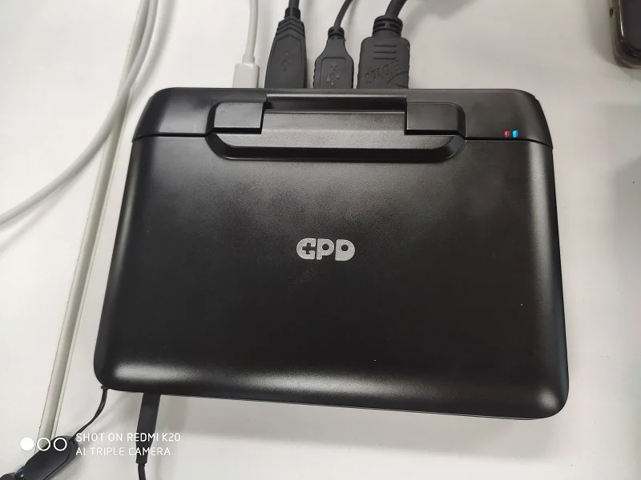
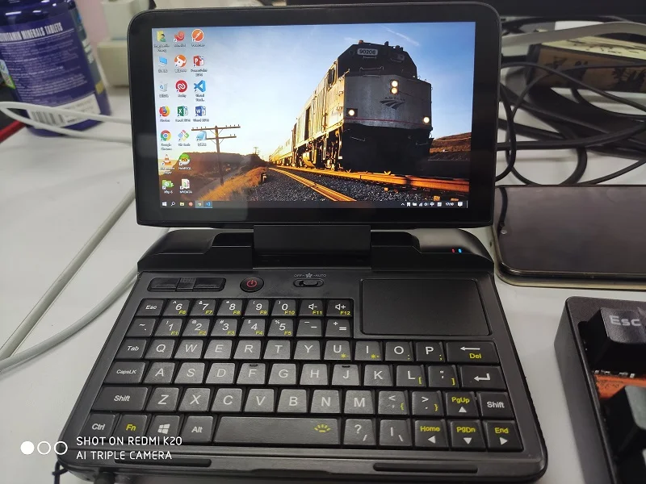
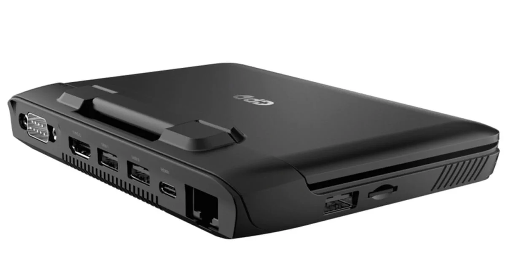

# 前言

四月还是五月的一天，无聊的我在地铁上刷今日头条，突然看到一个文章，说 GPD 又出新玩具了（准确的说是生产力工具）。一看价格也不贵，京东众筹 1999。于是买了一台，算是了却心愿。

说起来我对袖珍电脑有兴趣不是一两天了，一个是大学上课带电脑偷偷玩东西，电脑巨大无比不好藏，而且真的很重。大学用的昭阳 K29，虽然是台 12 寸的笔记本，但是由于巨大的 9 芯电池，
重量不输一般的 15 寸笔记本，每天上课十分健身。所以一直以来都想要小型化的电脑。

上班后，在北京的公司里接了一个做嵌入式设备的项目，然后做完了需要出现场调试设备。那个设备本质上是个工控机，但是没有屏幕。需要用串口线连进去 tty 控制，所以大笔记本也是麻烦。
那个时候就看到了 GPD Pocket ，没记错的话 3300，咬着牙买的。那个时候每个月到手也就6k，为了这个分期+吃土三个月。体验嘛，真的很方便，现场设备很小挂在墙上，
笔记本的话需要拖着很难搞。而这种便携设备只需要放在盒子里，连好线敲就是了。

那个嵌入式项目结束后，pocket 就一直在吃灰。究其原因，铝合金外壳，漂亮，但是烫手，ATOM 处理器真的很热。而且性能对于电脑软件真的稀烂，幸好我只用 XShell。Chrome总会无端崩溃，
估计也是性能的锅。而且，只有一个标准尺寸 USB 口，接了鼠标就没法弄U盘，为了 pocket 还买了个宜丽客马克鼠，就为了不占住 USB 口。（顺带一提，我的马克鼠也在吃灰）

<!--more-->

# 入手

我也不知道为什么我就突然想买这个。因为我已经没有需要出现场的活了，而且我还买了宏基的11寸笔记本专门做移动的活。两个USB口就很够用，而且大键盘也不错。至少比pocket的奇怪键位舒服很多。
但是，就是心里非常长草，最后决定还是拔掉。所以京东众筹我就参与了，等了一个多月，6月多发货。从南山科技园那边发到这边，中通居然要交换到深圳市总集散中心，也不知道是什么奇怪的玩法。

合盖状态是这样的：

然后打开它是这样的：

你没有看错，后面插了一排的线。GPD 现在终于弄明白了自己的定位，Windows 机器就是生产力，而不是简单的做一些Windows掌机。
这次主打的买点是工程师必备电脑，接口齐全的令人发指，这也是我买它的原因。

这个小电脑有以下接口：

- USB Type-A x3
- RS232 串口 x1
- HDMI x1
- USB Type-C x1
- RJ45 x1
- MicroSD 读卡器 x1

是的你没有看错，不是MicroHDMI，是全尺寸的HDMI。RJ45网线口也是标准大小，3个标准尺寸USB端口完全不需要OTG线之类的累赘，还有个RS232端口可以用来处理该死的串口交换机。几乎不需要任何转接头。

# 简单测评和调教

老套的参数我不想细说，这东西百度 GPD MicroPC 一抓一大把。简单说一下，京东众筹的这版是 8G 内存+ N4100 的，国外版众筹只有 4GB 版本。大内存应对Chrome之类的巨无霸应用还不算吃力。

键盘使用起来呢，肯定没有pocket那种大键盘舒服，但是作为一个应急本，应该没人想在上面用键盘敲长篇大论吧。而且这次的键位还算正常，不像pocket经常按错。

然后这次的散热异常给力，背面巨大的散热窗口，我都能看到风扇本体。外加风扇开关，可以选择关闭让它被动散热，也可以选择让风扇转起来。根据我听声估测得有800-1000转吧，反正高负载的时候风扇确实很有效。

屏幕，不同于pocket，这次GPD MicroPC的不是触屏，导致某些操作就得去操作右上角的那个触摸板，手感还不错，但是我习惯于Mac式的滚屏，我的linux主机和Windows机都改过滚动方向。
到这里就很不适应，中途也搞了很多方法，结果发现它这个触摸板是作为PS/2鼠标接进去的，滚动在BIOS里就处理了。等了一个星期官方发布了翻转滚动的BIOS，刷进去就好了。**痛点解决**

还是滚屏相关的，不同于pocket没法手持只能桌子上用，这次的 MicroPC 非常适合端起来使用，我经常使用它在床上举着上网侧着上网。这个时候双指触摸板滚屏就很不现实。解决方案也有，
但这次不是官方的方案了，使用XMouseButton映射鼠标键中键，设置为按下后配合单指触摸板滑动上下滚屏，目前体验超好。**痛点解决**

目前来说 GPD MicroPC 是满足了我的需求。从前面的图片你们可以看出，我装了xshell装了vscode和office全家桶。体验嘛，应急打字，修服务器都不在话下。我可以安心的把我的SSH密钥放进去，然后从不离身。随时保持对服务器的控制。像是自己私钥这种东西，放在公司电脑里是很难令人放心的。

我在公司尝试使用这东西办公了一天，期间chrome三四个标签页，除了偶发标签页崩溃其他还好（估计还是cpu孱弱）。然后vscode写Golang的代码，后台Go的工具链频繁分析语法给智能提示啥的，完全没问题。
使用的时候，HDMI接显示器，键盘鼠标一插，再插上电源，完全体的移动办公室。不需要任何转接头。

# 优缺点和值不值得买

## 优点

- 小巧，一巴掌大，6寸屏幕，同事都说像文曲星。
- 标准 Windows 10 专业版，这东西居然给了套正版win10专业版（虽然绑定机器的）
- 接口过于齐全，之前买的转换器都没用了。
- 可自己更换SSD，用的NGFF标准接口。客服群里有人改了512G的，不过发热有点感人。
- 运行轻度应用毫无压力（你要是指望用这东西P图压片子就不要想了）
- PD2.0 TypeC充电口，随便找个PD2的快充就行了，甚至手机充电器支持PD2也成。（推荐Anker超极充，还能当充电宝用，就是原装线太短了）

## 缺点

- 电池，差不多4-5小时，也可能和我的应用状态有关，反正没有Pocket电池耐用。
- 屏幕只有720P，6寸720p有点难受，而且某些exe应用对720px高的电脑不友好，有些沙雕专业软件为了768屏幕做的
最下面一排按钮看不到，需要拖拽。
- 重，虽然相比正常的电脑轻便很多，但是依然是通勤出门的累赘。（不过是个出差小帮手，可以扔进行李箱或者肩挎包，不占多大空间）

## 值不值得买

这种小众产品值不值得买还是要看个人，我在B站看测评的时候一帮人都在纠结游戏性能。想想也是，这帮学生每天就是玩游戏自然是游戏最重要，不能打游戏的都是垃圾。
只有上班狗才知道，当你出现场调试设备，站在船上摇摇晃晃，举着一个全尺寸的15.6寸高性能游戏本是多沙比的一幕。
这种小东西作为工作用机，能运行厂商提供的各种诡异土制MFC exe，有串口有网口，只要1999。相比拿着自己心爱的笔记本在河上飘飘荡荡还要举着练臂力改设备的配置文件，
肯定是这种东西超值的很。simple but it works 就够了。

当然，你要是没有特殊需求买了玩玩也是可以的，小尺寸Windows设备我也就见到GPD还在做了，而且主打的都是各色掌机，像Win2配置更高，但是要4k+。这种工作本真的不多见。

如果你是想拿来玩游戏，那么千万别买，这东西不是你的菜，虽然有人尝试用这玩意跑动GTA了，但是那个帧率惨不忍睹你真的能玩下去？有这个钱不如赶紧去买个Switch体验下真正的游戏。