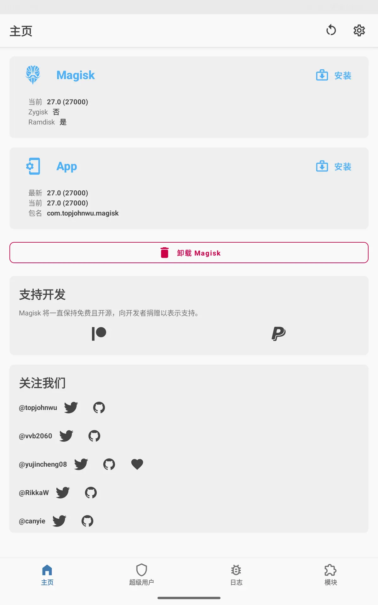
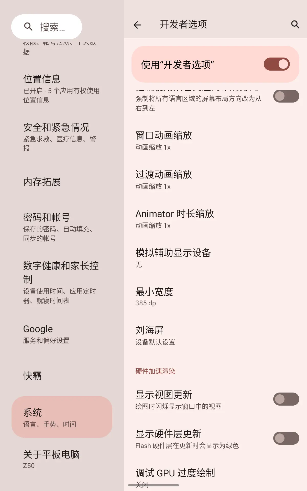
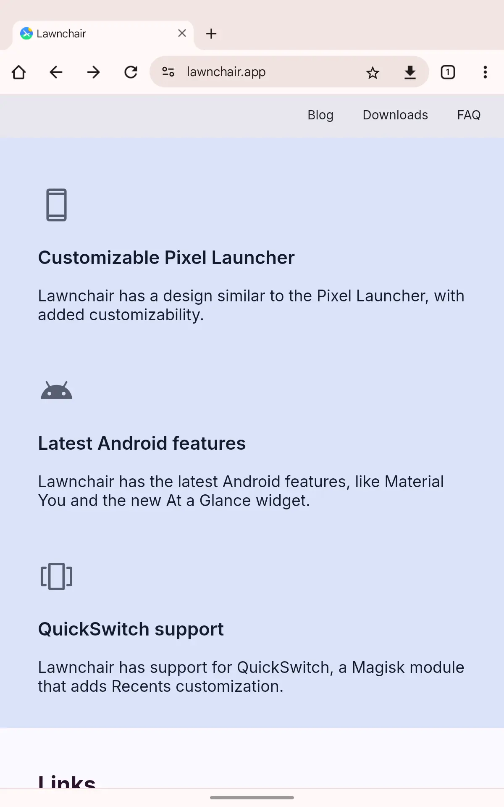
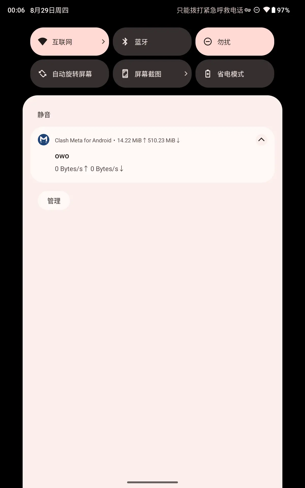
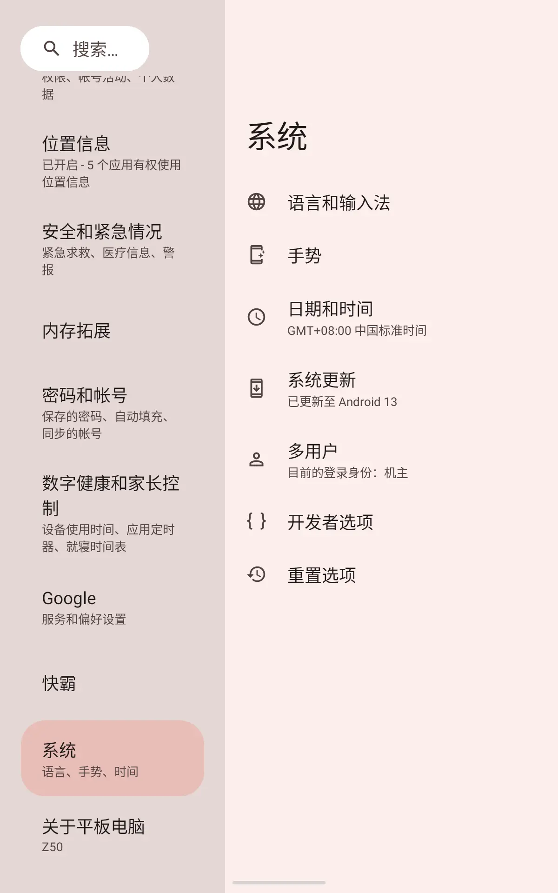
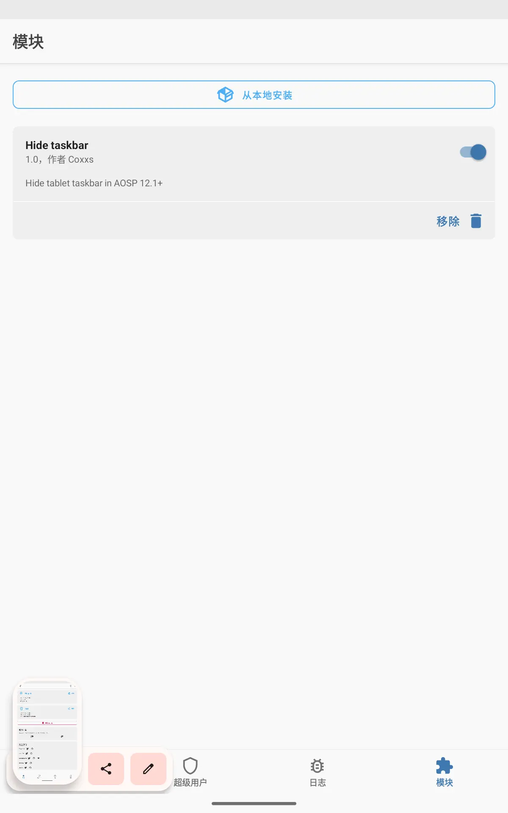
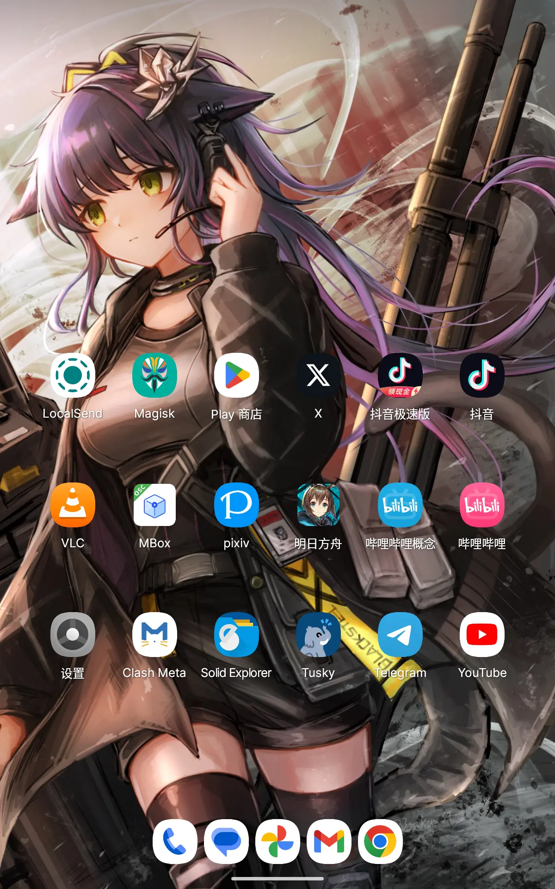

> 这是掌玩 mini 的第二篇文章,其他内容可以参考第一篇。

# 前言

上一次写的测评文章我看了一下，2024-02-29，今天08-29，算用了快小半年，体验还不错，也调教的差不多了。

首先本文只针对 掌玩mini 2024 NFE 8G+256G 版本，官方代号 T811MAN。我不知道和国内在售版本有硬件上的区别，但是照搬掌玩 mini 的刷机教程没有成功过。

# GSI

首先，不要碰 GSI。NFE版本暂时没有可以成功刷入的 GSI，我已经试过很多次了，基本都是无限重启。

看老外群组内的反馈，很多人都能成功刷入，不过都是普通版本的，并不是 NFE 版本。
也有老外给 NFE 版本固件刷到普版上，并没有出现 L1 的 DRM 标识，这说明很有可能这俩硬件层面有细微的变化。

如果你搞定了可以分享教程给我。

为了防止变砖，所以我准备了线刷包，这个线刷版本是 `iPlay50miniProNFE(T811MAN)_EN_20240520`，OTA 上刷不到这个更新。多次GSI失败救砖后，版本自然升级到了这个版本。

<!--more-->

# Root

既然 GSI 装不上，一个标准版的Root必不可少。我试了 KernelSU ，刷进去无限重启。但是传统的 Magisk 可以。

按照官方教程使用 `fastboot.exe flashing unlock` 先解锁 bootloader，这一步会清除所有数据。

然后重启进入正常系统，安装 Magisk 的应用，找到线刷包里的 `boot.img` 复制进 pad，使用 Magisk 进行补丁。

补丁后的 `magisk_patched.img` 复制回电脑，使用 `fastboot flash boot magisk_patched.img` 把刚才的文件刷进 pad，重启即可得到 root 权限。

几乎无门槛。

# 调整最小宽度

掌玩mini最奇怪的一点就是明明大部分时间都在竖屏使用，但是设置页面又像其他平板一样强制左右分栏。默认的最小间距也很奇怪，调整到380+以后正常许多。目前看来380是平板/手机的分界线。

调整后，Chrome使用平板模式，可以多个 Tab。

通知中心下拉再也不是四个图标，不会出现突出来一个丑死人的问题了。

设置界面也是看着顺眼许多，不再挤成一团。

另外建议使用手势操作，要不然三大金刚按键会叠加taskbar，很奇怪。
如果要隐藏 Taskbar 可以参考下文。

# 隐藏 Taskbar

使用一个简单的 Magisk 模块，加载后长按底部Taskbar空白区域即可隐藏，每次重启需要重新操作

# 启动器更换

官方启动器总觉得很奇怪，都优化完了建议后续自己装一个。
这里用了米米推荐的`Lawnchair`。

# 后记

基本要折腾的点就这么多，原厂 ROM 有原厂的好，就是不用折腾 4G 这些东西。设置界面丑点就丑点吧，日常也不打开它看。再有需要定制的东西用 Root 权限也能搞定，就先这样吧。