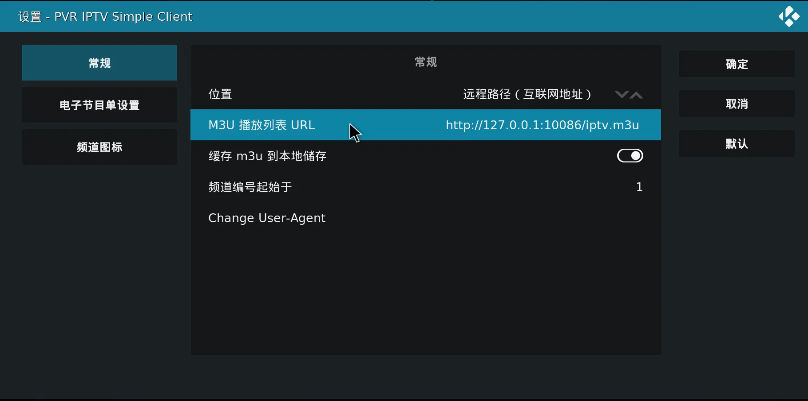
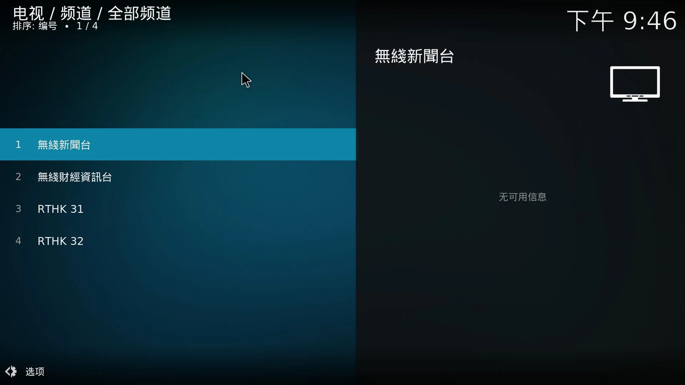

> 花了两整天时间搞了一个Kodi适用的香港电视直播代理。

这篇还是IPTV相关的东西，香港电视台的直播解析可以看前两篇博客，分别写了 RTHK 31/32 和 TVB 无线新闻 / 财经资讯台 的解析方法。

众所周知 Kodi 是一个集成式的播放平台，本次的主要目的就是改造 TVProxy 让它可以支持 Kodi 的 `PVR IPTV Simple Client`，并且准备两种安装方法的必须文件。

首先，Kodi 的 IPTV 插件需要自行安装。然后可以看到，PVR 插件需要一个M3U文件。在谷歌搜索M3U可以找到大量现成的M3U文件，可以参考他们的格式。

<!--more-->

在这里我就直接给出正确格式了：

```m3u
#EXTM3U
#EXTINF:-1, 电视台名称
http://example.com/iptv.m3u8
```

有多个电视台的情况下不停重复2-3行即可。由此可以看出，可以直接让 TVProxy 输出一个预制的M3U，毕竟我们只有写死的四个台。

```go 
func m3uHandler(c *gin.Context) {
	m3u := `#EXTM3U
#EXTINF:-1,無綫新聞台
${baseURL}tvb/inews.m3u8
#EXTINF:-1,無綫財經資訊台
${baseURL}tvb/finance.m3u8
#EXTINF:-1,RTHK 31
${baseURL}rthk/31.m3u8
#EXTINF:-1,RTHK 32
${baseURL}rthk/32.m3u8
`
	processedBody := strings.ReplaceAll(m3u, "${baseURL}", baseURL)
	c.Data(200, "application/vnd.apple.mpegurl", []byte(processedBody))
}
```

让我们启动这个程序，然后在 PVR 中填上 `http://127.0.0.1:10086/iptv.m3u`，重启 Kodi 后就可以看到对应的频道清单了。






现在就可以舒服的在Kodi上看港台了。

如果你是 HTPC/服务器 可能需要考虑开机自启动的问题。虽然我写了Docker文件，但是不推荐在本地环境适用，仅适用于服务器环境。
注意，RTHK由于被墙所以采用了直接转发，如果部署在服务器上会很消耗流量。请注意自行添加防护手段免得被人爬走导致流量费用爆炸。
Docker部分我就不说了，注意以下参数：

|环境变量|作用|
|---|---|
|TVPROXY_LISTEN|决定程序监听哪一个地址上的哪个端口，默认值为"127.0.0.1:10086"|
|TVPROXY_BASE_URL|决定程序对外服务的地址前缀，默认值为"http://127.0.0.1:10086/"|

TVProxy受`HTTP_PROXY`这个环境变量影响，所以在本地使用时如果想给程序挂代理直接指定`HTTP_PROXY`的值即可。

说一下我自己的部署方案：

我有一台类似NUC的无风扇主机，安装Manjaro+Kodi作为下载机和电视。所以TVProxy就装在这台主机上，通过指定`HTTP_PROXY`走本地的HTTP代理出境。

程序管理使用的是systemd，具体可以查看项目中的service文件。最后，如果你觉得好用请给star，[https://github.com/zjyl1994/tvproxy](https://github.com/zjyl1994/tvproxy) 。
作为个人项目来说，暂时不会接受任何功能需求的issue，要是这些直播源挂了的话倒是可以开issue让我修修，当然不能保证100%可修复，直播源这个东西谁都没有准。

提前祝你观影愉快，尽情享受 IPTV 吧。