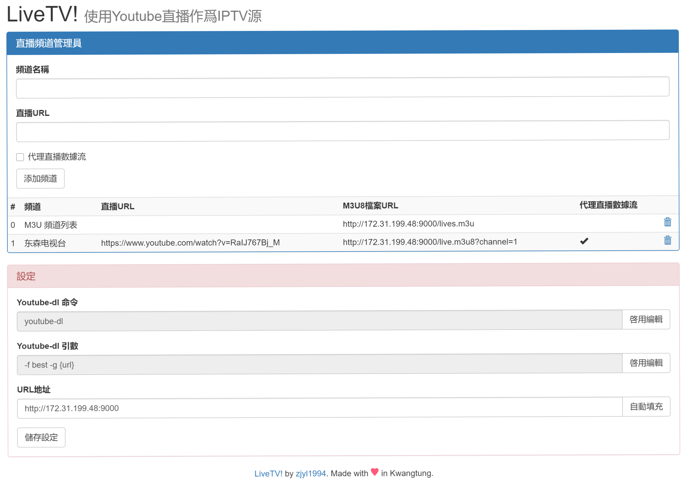

> 这篇是升级版！

# 前言

Youtube直播转IPTV直播源，基于Youtube-dl，我之前写过一个版本，那个版本因为是自己用的所以安装起来比较麻烦。

水完博客断断续续到现在还有人过来找我问我怎么安装，所以我花了两个星期断断续续做了一下优化。

现在这个工具被我命名为 "LiveTV!" 主要应用场景就是在电视或者其他支持M3U8的软件上直接播放Youtube的直播。

考虑到国内的网络问题，我还增加了代理模式，让电视不用搞飞机也能看。

# 安装教程

首先，你需要安装Docker。安装docker的镜像网上很多，如果你是 Ubuntu 之类较新的发行版可以直接使用apt安装。

如果你在服务器上使用老版本的CentOS7或者Ubuntu14.xx，也可以搜索一下。Docker安装教学应该到处都是。

以下内容假定你已经安装好了Docker。

<!--more-->

## 正常安装

当你在可以直连Youtube的环境下安装时请参考这部分。（比如使用境外VPS或者你本身就在境外）

运行 `docker run -p外网端口:9000 -v宿主机目录:/root/data zjyl1994/livetv:1.0`，直接启动 LiveTV！

比如说我使用的命令就是 `docker run -d -p9500:9000 -v/mnt/data/livetv:/root/data zjyl1994/livetv:1.0`。

-p命令指定端口号是必须的，否则你将无法使用这个容器（或许你可以使用host模式开启这个容器，但是会占用9000端口）

-v指定了`/mnt/data/livetv`作为外部存储目录，这个主要用来存放LiveTV运行产生的数据库和日志文件。

如果不指定外部存储目录，LiveTV将在每次重启时丢失你添加的频道信息。

## 代理模式安装

当你不能直接链接Youtube时，你需要首先有一个飞机。具体怎么弄自己查，此处假定你的飞机地址为 `socks5://192.168.1.1:10808`。

运行 `docker run -p9500:9000 -eHTTP_PROXY=socks5://192.168.1.1:10808 -eHTTPS_PROXY=socks5://192.168.1.1:10808 -v/mnt/d/workspace/livetv/data:/root/data zjyl1994/livetv:1.0`

此时，LiveTV应该可以联网并正确缓存频道地址了。

# 使用教程

考虑到不是所有的人都会写配置文件所以我搞了个非常简易的面板。

面板的访问地址是`http://你的外网ip:你设定的端口`，比如我自己的面板就是`http://192.168.1.100:9500`。

这个面板还有英文版，不过考虑到能读到我这篇文章的读者应该都能懂中文，还是放中文版的图比较好。

使用起来很简单，必须要做的一步就是点击红色设定框中的“自动填充”按钮（也就是URL地址那列的按钮）

原因是设定M3U8需要获取程序运行的外网地址，做自动感知倒是也可以，但还是要给用户修改的权力，毕竟自动感知不可能非常完美。

点击“自动填充”按钮，等待URL地址中的地址发生变化，再点击“储存设定”就可以愉快的使用了。

在蓝色的“直播频道管理员”设定框中可以输入频道名称和Youtube的地址，点击“添加频道”，向LiveTV中增加新的托管频道。
如果你是在VPS或者其他设备上安装，想在电视等不支持飞机的设备上观看，请勾选“代理直播数据流”。

添加成功后下面的表格中会多出你新增的频道，此时复制M3U8那一列的URL丢进电视或者VLC之类的播放器就可以播放了。

如果你是使用Kodi或者其他软件，需要M3U文件，或者你只是单纯的懒得一个一个向电视添加直播源，
可以尝试使用第一行“M3U频道列表”中提供的M3U文件。

# 备注

Youtube的链接每6小时失效一次，所以说我做了一个每隔4小时刷新所有频道youtube链接的功能。
Youtube-dl本身比较慢，不适合每次点击都现解析，所以缓存是必不可少的。如果你遭遇断流，可能就是链接失效了。
解决方法也很简单，只要切到别的台再切回来，让电视重新读取最新缓存到的地址即可。

感谢Youtube-dl这么伟大的项目，也祝你的IPTV看的愉快~

（友情提示，操作面板拉到底有一个Log链接，点过去可以查看程序的日志，如果遭遇500可能就是Youtube-dl无法解析，
多半是没有正确配置代理，可以自行排查。想要调节清晰度等请自行修改Youtube-dl的参数，默认是最高画质。）