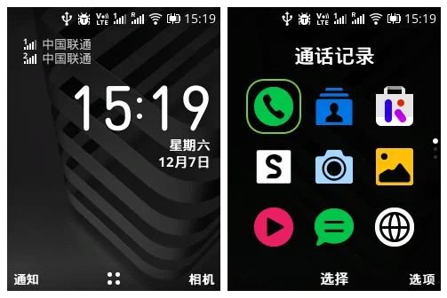
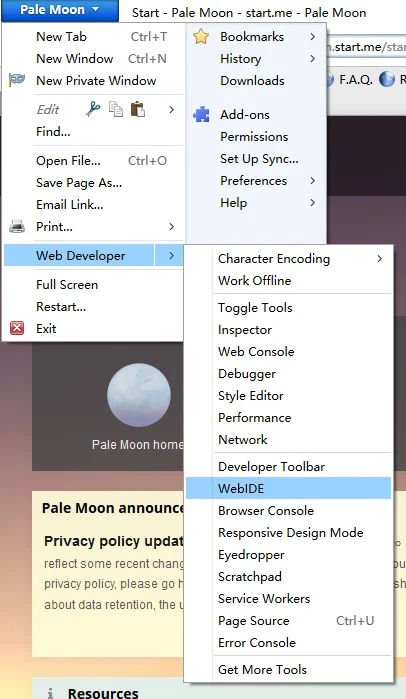
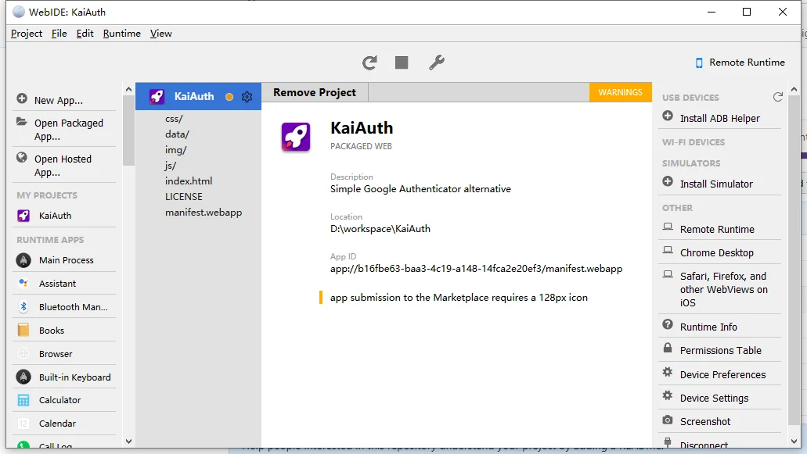
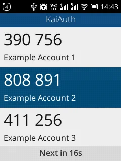

> 11 月末冒险过关去 HK 买了一部诺基亚 2720 Flip

# 前言

2019年9月5号，HMD 发布了 Nokia 2720 Flip，一部翻盖的半智能机。

个人对翻盖机还是很喜欢的，之前纯为了情怀买过一个飞利浦的真功能机，结果只支持 GSM，2019 年 GSM 已经不行了，很多时候信号都没有。而这部 2720 Flip，支持4G、VoLTE、热点分享，瞬间种草各种想买。

当时说，2019 年第四季度大陆发售，结果转眼间从 10 月等到 12 月，每天跑去诺基亚中国的微博下蹲守也不见发布，正好有朋友约了我过关买东西，我就去丰泽拎了一部港版 2720 Flip 回来。

淘宝上很多卖这个的，基本都是 799 RMB，但是丰泽的官网上显示只要 798 HKD，考虑到港币的汇率，实际到手价格也就710 RMB。（不过丰泽只有黑色版本，也不知道为啥没有白的可以买）

<!--more-->


# 系统

KaiOS 用起来，有种 S40 和 S60 的混合体，可能年轻人都没用过这东西了吧？



在香港的时候，连上丰泽的 WiFi ，桌面上有 Youtube、Twitter、WhatsApp，甚至有 Google 助理。

但是我拎回来，插上大陆的电话卡，这些东西全都消失了，甚至自带的小游戏都没了。

KaiStore 也还行，可以直接访问没有被墙掉。但是里面可用的应用非常少，你可以理解为商店只是个摆设。

# 折腾

作为一个备用机，我主要的需求就是密码管理器和两步验证，密码管理器我现在有在线版的可以用，但是两步验证，之前只能用智能手机。Authy 必须要谷歌框架，而一般的国内手机很少有这种东西。所以我对 TOTP 应用比较有需求。

KaiOS 是一个 HTML5 驱动的半智能手机，基于停止开发的 Firefox OS 二次开发，也就是说你只要会前端技术就可以给这个写 App。要开发，首先要打开开发者模式。输入`*#*#33284#*#*`，直接进入调试模式，可以看到状态栏上有个 DEBUG 图标。

电脑上要安装 ADB，没有的可以直接在[这里](https://developer.android.com/studio/releases/platform-tools.html#download)下载。装好 ADB，就可以尝试连接了。（我是不太知道为什么 KaiOS 要用 ADB 链接）使用`adb forward tcp:6000 localfilesystem:/data/local/debugger-socket`命令一键连接。 

电脑上的调试器，可以使用 Pale Moon，虽然都推荐 Firefox 59 ESR 版本，但是因为这个东西每次都要自动升级，就很麻烦。所以推荐用不会强行自动升级的 Pale Moon 28.6.1，找不到可以直接点[这里](https://rm-eu.palemoon.org/release/palemoon-28.6.1.win64.installer.exe)下载。





## KaiAuth

KaiOS 的开发说简单也简单，说复杂也复杂，可能是我没有相关的前端经验。先来看我的最终成品：



首先要理解一个概念，KaiOS 并没有官方的 UI 库和控件，你可以理解为一个全屏的 Firefox 浏览器，你所看到的一切都是用 HTML 和 CSS 一点点画出来的。（也就是上图除去最上面一行状态栏，其他都是要自己实现）

我首先看了 KaiOS 的官方开发者网站，推荐的是 [KaiUI](https://github.com/AdrianMachado/KaiUI) ，但是这个并不能用，依赖遭到破坏不能顺利安装。

后来找到了一系列的 react 工具链，但是折腾很久都不会弄。 （项目创建工具：[create-kaios-app](https://github.com/kaios-design/create-kaios-app) ，配套的 UI 库：[Kaid](https://github.com/kaios-design/kaid) ）

最后，我的办法最后就是用原生 Javascript 写。参考了 OmniSD 的代码，总共花了不到一晚上就写好了。

### 界面

KaiOS 的界面有一定的设计指导，大部分界面都由三个区域组成。标题栏就是最上面蓝色的 KaiAuth 那一行，最下面的是软键，由于我这个应用非常特殊，不需要软键。所以我就把软键区改成了验证码倒计时提示。

中间的区域，是最重要的信息区。KaiAuth 中，这个区域是一个列表，上部大大的验证码，下面是验证码对应的名字。这个列表可以用方向键上下滚动。

这部分就是简单的 HTML + CSS写成，重要的是用`position: fixed;`把对应的元素固定到该去的位置。

### 按键

KaiOS 的按键需要你自己使用 js 进行响应，包括软键，因为软键也是你自己画的。 具体的实例可以参考官方的[教程](https://developer.kaiostech.com/core-developer-topics/dpad-navigation)。官方的五维导航键例子就是这样的：

```js
document.activeElement.addEventListener('keydown', handleKeydown);
function handleKeydown(e) {
  switch(e.key) {
    case 'ArrowUp':
      nav(-1);
      break;
    case 'ArrowDown':
      nav(1);
      break;
    case 'ArrowRight':
      nav(1);
      break;
    case 'ArrowLeft':
      nav(-1);
      break;
  }
}
function nav (move) {
  const currentIndex = document.activeElement.tabIndex;
  const next = currentIndex + move;
  const items = document.querySelectorAll('.items');
  const targetElement = items[next];
  targetElement.focus();
}
```

`ArrowUp`、`ArrowDown`、`ArrowRight`、`ArrowLeft` 是导航键的四个方向，`Enter` 是方向键中间按下。`SoftRight`、`SoftLeft`是左右软键。其他按钮就直接和键盘上印的一样了，123 就是 123。

### TOTP

谷歌验证器用的数字生成算法，就是标准的 TOTP 算法，每隔 30 秒一个切换。这个也不需要自己来实现，有专门的 [otplib](https://otplib.yeojz.dev/) 库可以使用。要注意，otplib 是针对 Node.js 环境用的，KaiOS 是标准的 Gecko 48 环境，不是 Node ，所以要使用 otplib-browser 版本。下面是 TOTP 的例子：

```js
var secert = 'WUABTBGATYBBEURE'; // TOTP 中的密钥
var code = window.otplib.authenticator.generate(secert); // 生成的验证码
var remain = window.otplib.authenticator.timeRemaining(); // 验证码剩余的时间
```

最初的实现，是每秒刷新一次，但是这样会导致滚动列表时的闪烁问题。所以，现在每秒更新的是 remain 这个数值，当 remain 为 30 时，重新生成一波验证码并显示。

TOTP标准的添加方法是扫描二维码，但是没有合适的资料可以借鉴，短期内无法实现。

从原理上来说二维码会解析出一个 otpauth 开头的 uri，解析后就能得到 secert 和其他设置信息。


解码出来，就是：` otpauth://totp/otplib-website:otplib-demo-user?secret=WUABTBGATYBBEURE&period=30&digits=6&algorithm=SHA1&issuer=otplib-website `

### 数据源

数据的存储同网页，可以用 localStorage 实现。但是本应用中不太一样，因为目前还不能支持扫码添加账号， 而且 KaiOS 并没有提供文件选择器直接提取文件，所以说最简单的办法就是把数据文件直接写入 app 内部，等后期有时间再做改进。KaiOS 可以读取 SD 卡，但是需要特别提请授权，可以查看 [API 手册](https://developer.kaiostech.com/api/device-storage/devicestorage) 学习。

要访问本应用包内的数据，KaiOS 并没有提供特别的 API ，所以还是要使用传统的 XHR 或者 fetch。为了简单我选择了 fetch。

```js
fetch('data/data.json')
.then(res => res.json())
.then((out) => {
    // out 就是已经处理好的js对象了
});
```

### 方向键滚屏

方向键滚屏其实是这中间比较重要的一件事，如果不滚动，方向键一路滚动选择条往下，最后会走出屏幕。这样会导致屏幕区域外的看不到，影响使用体验。所以需要记录滚动位置，点亮对应的 Item，核心代码就是这样的：

```js
var selectIndex = 0;
var mainlist = document.getElementById('authcodes');
function selectItemByIndex() {
    [].forEach.call(mainlist.children, function(el) {
        el.classList.remove('active');
    });
    let activeElem = mainlist.children[selectIndex];
    activeElem.classList.add('active');
    activeElem.scrollIntoViewIfNeeded(false);
}
window.addEventListener('keydown', function (e) {
    switch (e.key) {
        case 'ArrowUp': //scroll up
        case 'ArrowLeft':
            selectIndex--;
            if (selectIndex < 0) selectIndex = authcodes.length - 1;
            selectItemByIndex();
            break;
        case 'ArrowDown': //scroll down
        case 'ArrowRight':
            selectIndex++;
            if (selectIndex > (authcodes.length - 1)) selectIndex = 0;
            selectItemByIndex();
            break;
    }
});
```

`scrollIntoViewIfNeeded` 是一个非标的方法，是 WebKit 世界的东西。因为 KaiOS 的渲染引擎是 Gecko，所以这个其实是没有用的。所以我们要单独找一个 Polyfill 来实现这个功能。

```js
// scrollIntoView polyfill
// from https://gist.github.com/KilianSSL/774297b76378566588f02538631c3137
if (!Element.prototype.scrollIntoViewIfNeeded) {
    Element.prototype.scrollIntoViewIfNeeded = function (centerIfNeeded) {
        centerIfNeeded = arguments.length === 0 ? true : !!centerIfNeeded;
        var parent = this.parentNode,
            parentComputedStyle = window.getComputedStyle(parent, null),
            parentBorderTopWidth = parseInt(parentComputedStyle.getPropertyValue('border-top-width')),
            parentBorderLeftWidth = parseInt(parentComputedStyle.getPropertyValue('border-left-width')),
            overTop = this.offsetTop - parent.offsetTop < parent.scrollTop,
            overBottom = (this.offsetTop - parent.offsetTop + this.clientHeight - parentBorderTopWidth) > (parent.scrollTop + parent.clientHeight),
            overLeft = this.offsetLeft - parent.offsetLeft < parent.scrollLeft,
            overRight = (this.offsetLeft - parent.offsetLeft + this.clientWidth - parentBorderLeftWidth) > (parent.scrollLeft + parent.clientWidth),
            alignWithTop = overTop && !overBottom;
        if ((overTop || overBottom) && centerIfNeeded) {
            parent.scrollTop = this.offsetTop - parent.offsetTop - parent.clientHeight / 2 - parentBorderTopWidth + this.clientHeight / 2;
        }
        if ((overLeft || overRight) && centerIfNeeded) {
            parent.scrollLeft = this.offsetLeft - parent.offsetLeft - parent.clientWidth / 2 - parentBorderLeftWidth + this.clientWidth / 2;
        }
        if ((overTop || overBottom || overLeft || overRight) && !centerIfNeeded) {
            this.scrollIntoView(alignWithTop);
        }
    };
}
```

简单来说，就是计算边距然后判断是否在可视范围内，不在就滚动到对应的位置。一般的 `scrollIntoView` 就只能做到上对齐，但是`scrollIntoViewIfNeeded`可以做到根据距离对齐最近的一边。这样列表的滚动体验和传统的S60手机接近了。

### 安装和使用

1. 下载 KaiAuth 项目

2. 编辑 `data/data.json`，把你的名字和密钥写进去。（注意，显示的顺序就是你JSON中写的顺序）

3. 打开 WebIDE，加载 KaiAuth 项目

4. 按照前文所述开启手机调试模式

5. 点击 三角形 播放键直接下载到手机中


这样一个能用的 KaiAuth 就装好了。

# 后记

## 感受

KaiOS 本身可玩性不足，而且 2720 价格很高。但是它可以使用 HTML5 编写 app，前提是你有足够的前端经验。

由于官方没有给任何内置的UI或者控件库，所以有种给你个 GDI 句柄自己画界面的感觉，甚至要自己处理消息循环响应控件按键，感觉非常的原始。

KaiAuth 为了实现简单，其实是不可用的状态，因为数据从 app 内部加载。如果未来有时间的话，我会给它更新扫描二维码添加和导入导出功能。这样不仅仅需要实现拍照，也要自己实现多 activity 切换，而且导入导出也要自己实现一套文件选择逻辑。目前看来，并没有相关的第三方库可以用。想要实现这些功能，基础控件和页面切换还是要自己整的。

## 相关链接

- [诺基亚 2720 官方主页](https://www.nokia.com/phones/zh_int/nokia-2720)
- [丰泽 2720 信息页面](https://www.fortress.com.hk/zt/product/2720-flip-mobile-phone/p/BP_11914043)
- [KaiOS 官方开发者门户](https://developer.kaiostech.com/)
- [官方的 ToDo Demo](https://developer.kaiostech.com/getting-started/build-your-first-package-app/sample-code)
- [BananaHackers](https://sites.google.com/view/bananahackers)
- [独立版 ADB](https://developer.android.com/studio/releases/platform-tools.html#download)
- [Pale Moon 28.6.1 下载](https://rm-eu.palemoon.org/release/palemoon-28.6.1.win64.installer.exe)
- [KaiUI](https://github.com/AdrianMachado/KaiUI)
- [create-kaios-app](https://github.com/kaios-design/create-kaios-app)
- [Kaid](https://github.com/kaios-design/kaid)
- [官方五维导航键教程](https://developer.kaiostech.com/core-developer-topics/dpad-navigation)
- [otplib](https://otplib.yeojz.dev/)
- [存储 API 手册](https://developer.kaiostech.com/api/device-storage/devicestorage)