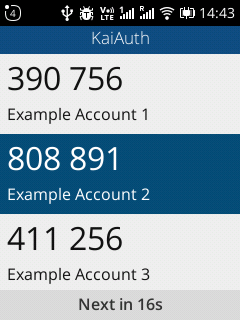

> KaiAuth 是一款 KaiOS 上的谷歌验证器替代品

12月初的时候，我用原生 JavaScript 实现了第一版的 KaiAuth。具体可以看之前的博文。

如果没有耐心看下去也可以去 https://github.com/zjyl1994/KaiAuth/releases/ 直接下载最新版编译好的应用。

<!--more-->

## 改进目标

首先，需要确认改进点，旧版本的 KaiAuth 是这样的：



目测可以看到：没有添加删除，没有其他功能，只有简单的看两步验证代码和一个方向键滚动屏幕。

添加删除账号需要修改 `data/data.json` 然后重新部署。

期望的改进点是，可以手机自己独立增加删除账号，所以引入左右软键。左边是`Add`，右侧是`Delete`


（上面的是已经做了多语言的截图，感谢 LiarOnce 的贡献）

考虑到添加需要扫描二维码，所以说需要实现一套扫码的页面和逻辑。


扫码功能界面就长这样。扫描到二维码会自动添加并返回主列表。

## 实现

### 存储

首先，KaiAuth 第一版使用 `fetch('data/data.json')` 加载软件内的 JSON ，没有办法实现动态修改。在第二版中，使用 `localStorage` 存储，可以方便的修改。

列表数据采用JSON存储，格式如下：

```json
[
    {
        "id":1,
        "name": "Example Account 1",
        "secret": "2DMCERI7V4OPLHYBWNLQ4WASIIH4XZTP"
    },
    {
        "id":2,
        "name": "Example Account 2",
        "secret": "MYCX4VGRCNXXCVXEDC2ZLPM6MZORO55Z"
    },
    {
        "id":3,
        "name": "Example Account 3",
        "secret": "JBSWY3DPEHPK3PXP"
    },
    {
        "id":4,
        "name": "Example Account 4",
        "secret": "LL7HWMUW77Z75J3D"
    },
    {
        "id":5,
        "name": "Example Account 5",
        "secret": "WUABTBGATYBBEURE"
    }
]
```

`localStorage`只能存储字符串，所以要保存成JSON格式。通过`authcodes = JSON.parse(window.localStorage.getItem("authcodes"));`可以拿到保存的列表。

### 删除

删除功能比较简单，只要在列表上绑定`data-id`，然后获取到当前`active`的那条数据的id，去authcodes数组里删掉即可，然后刷新UI。

### 扫码增加

扫码功能是本次的难点，首先，扫码库我选择`jsQR`。

通过查看官方Demo：https://cozmo.github.io/jsQR/

可以获得以下代码：

```javascript
navigator.mediaDevices.getUserMedia({
    audio: false,
    video: { facingMode: "environment" }
}).then(function(stream) {  
    video.srcObject = stream;
    video.setAttribute("playsinline", true);
    video.play();
});
```

video对象是`<video>`标签，用户看到的内容就是摄像头获取的视频流。

考虑到方便用户使用，扫描到二维码的时候就应该获取结果，无需用户做更多操作。

```javascript
function capture(){
        if (video.readyState === video.HAVE_ENOUGH_DATA) {
            canvas.height = video.videoHeight;
            canvas.width = video.videoWidth;
            canvasContext.drawImage(video, 0, 0, canvas.width, canvas.height);
            var imageData = canvasContext.getImageData(0, 0, canvas.width, canvas.height);
            var code = jsQR(imageData.data, imageData.width, imageData.height, {
                inversionAttempts: "dontInvert",
            });
            if(code){
                activityHandler.postResult(code.data);
            }
        }
    }
```

每隔200ms触发一次`capture`，检测`video`的状态，当`video`有数据的时候，通过`canvas`把`video`的当前帧画过去，这样可以获取照片数据，交给`jsQR`进行检测。当`jsQR`读取到内容后，`code`里就会有二维码的内容了。

### 多Activity

和Android一样，Kai OS也是有activity设定的。

activity需要在`manifest.webapp`中提前注册。首先需要指定`origin`,一个简单的例子如下：

```json
{
    "origin": "app://kaiauth.zjyl1994.com",
    "activities": {
		"com.zjyl1994.kaiauth.addCode": {
			"href": "./add.html",
			"disposition": "inline",
			"returnValue": true
		}
	}
}
```

指定`href`为activity的页面，`disposition`为inline（inline模式下显示为弹出层，也可以选择window，会新开一个页面），`returnValue`控制是否可以读到返回值。如果你需要activity返回一些数据，可以设置为true。

#### 启动Activity

```javascript
var Activity = new MozActivity({
    name: '前面注册的activety名字'
})
Activity.onsuccess = function () {
    ActivityResult = this.result;
}
```

以下代码执行后，会调用系统自带的函数启动新activity，结果会返回到ActivityResult里。唯一美中不足的就是切换activity会短暂的出现一次应用的Splash（闪屏，指启动的loading页面），尚不清楚是特性还是bug。

ActivityResult 可以是Object，所以可以承载很丰富的数据。

#### 返回数据

```javascript
var activityHandler = null;
navigator.mozSetMessageHandler('activity', function(activityRequest) {
    activityHandler = activityRequest;
});
// 返回错误信息，通过onerror接收
activityHandler.postError('No QR Code');
// 返回成功数据，通过onsuccess接收
activityHandler.postResult('any object here')
```

调用post后会自动关闭activity。

### Shortcodes

Shortcode是老式按键手机最喜欢用的功能，通过数字按键得一系列特定组合，可以实现很多隐藏功能。

KaiAuth得隐藏功能如下：

| Shortcodes | 功能                                      |
| ---------- | ----------------------------------------- |
| *#0000#    | 查看版本信息                              |
| *#7370#    | 清空 localstorage，这会丢失所有的认证数据 |
| *#467678#  | 导入SD卡中的kaiauth.json文件              |
| *#397678#  | 导出当前数据到SD卡kaiauth.json中          |

