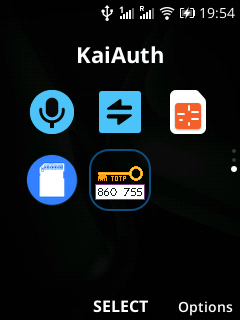
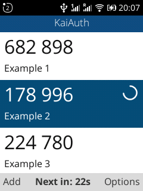
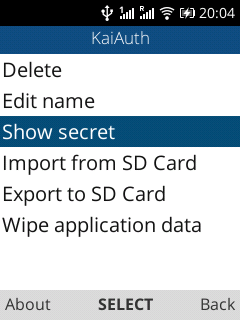
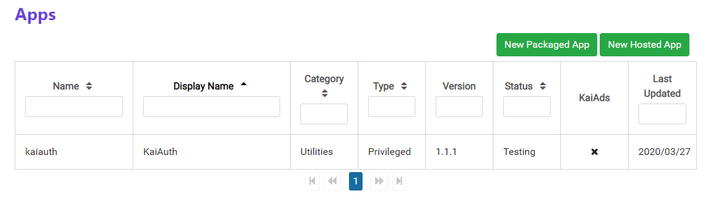

> 最近升级了一下 KaiAuth，目前版本 v1.1.1

就在前几天，偶然闲逛 Reddit，发现有外国人也很需要 KaiOS 上的 TOTP 工具。我就推荐了我的 KaiAuth ，
结果外国人并不知道如何OmniSD或者用WebIDE安装这个。我思考了一下，还是需要提交到官方商店。

考虑到 KaiAuth 早期版都是使用暗码开启高级功能的（其实是我懒得搞菜单），对于上架到官方商店来说，
我不能保证所有用户都会玩暗码这套，所以一个正常一些的菜单还是很重要的。

# 改造

先看看改造后的结果：







<!--more-->

## 图标改造

首先，2FA是一个非常大的概念，包括短信验证码、实体安全密钥之类的验证方式。所以说图标上用2FA不太合适，
对于我这个应用来说，TOTP 是非常合适的。所以用 Aesprite 重新画一下图标，改成 TOTP 就好了。

完成品是这样的：


## 菜单改造

考虑到官方没有提供 UI 库，菜单的实现需要自己用 CSS 画。最简单易行的方案应该是用 `web activities` 方式，
单独开启一个页面。这样页面滚动逻辑可以复用主界面的滚动逻辑。

菜单中提取出来的功能有这些：

- 删除（原先的右软键）
- 修改名字（新增功能）
- 查看密钥（新增功能）
- 从SD卡中导入（旧有\*\#467678\#）
- 导出到SD卡（旧有\*\#397678\#）
- 清除现有数据（旧有\*\#7370\#）

要注意的是，删除，修改名字，查看密钥在没有选中的代码项时应该禁用。

### Activity 值传递

这里面用到一个新的功能，`MozActivity` 的 data 传递。经过查阅代码，我发现了正确用法。

下面是我程序中提取的例子：

调用方：

```js
var menu = new MozActivity({
    name: 'com.zjyl1994.kaiauth.Menu',
    data: {activeId:authcodeActiveItem} // activeId 是你要传递的数据
})
```

接收方：

```js
navigator.mozSetMessageHandler('activity', function(activityRequest) {
    activityHandler = activityRequest;
    var activeId = activityRequest.source.data.activeId;
    // activeId 就是传递过来的数据
});
```
简单的来说，调用方传递的 `data` 对象，就是接收方的 `activityRequest.source.data` 对象。

### 禁用某些项

禁用某些项很简单，只要确保你的这些禁用项靠在一起，然后让按键滚动的时候滚不上去就好了。

具体可以参考 `menu.js` 中的实现。[代码在这里](https://github.com/zjyl1994/KaiAuth/blob/master/js/menu.js)

## 内建功能

我很庆幸 KaiOS 实现了基本的 js 对话框。简单的文字输入框，询问对话框和信息对话框都不需要自己来写了。
而且这些对话框都可以暂停住js的流程等待对话框，比自己实现的方便好用很多。个人建议，没有特殊需求的话，
用它自带这些就可以了。

### alert()

alert 是 js 提供的一个标准的消息对话框。

```js
alert('在这写消息');
```

### confirm()

confirm 会弹出一个对话框，询问你提供的文本，在2720上是左软键取消，右软键确认。

```js
var result = confirm('询问文本');
if(result == true){
    // 当用户按下确认的时候执行这里
}else{
    // 当用户按下取消的时候执行这里
}
```

### prompt()

```js
var result = prompt('提示文本');
if (result!=null && result!=""){
    // 当用户输入了非空消息时候执行这里
}
```

## 多语言改造

本次更新，我加了多语言支持。目前KaiAuth支持英文，简体中文，正体中文和广东话。
要注意的是，正体中文并不是简单的把简体中文做繁简转换就行的。这个需要多读正体中文的科技文章，
学习一下正体中文的惯用词。要做多语言一定要下功夫用心来做，要不然不如不做。

同样一个TF卡，简中环境喜欢叫`内存卡`，正体中文环境喜欢叫`記憶卡`,廣東話環境喜歡叫`記憶咭`。

简中环境叫`导入文件` `导出文件` 正体中文就叫 `載入檔案` `匯出檔案`。

語言這個東西還是很神奇的，要多學習。

# 提交商店

KaiOS 官方商店提交需要看一下 [官方提交文档](https://developer.kaiostech.com/submit-to-kaistore)。
按照要求改造 `manifest.webapp` 既可。

都做完之后登录 [Submission Portal](https://developer.kaiostech.com/devlogin) ,开始提交。
（神奇的是，这个页面不可以用之前注册的kaios防盗账户登录。所以我就重新注册了一个kaios账号。）



点击 `New Packaged App` ，上传 Web IDE 版的应用。然后点击 `Test Device`，输入你测试设备的 IMEI 代码。
等五六分钟后你测试机的商店里就能搜到你上传的应用了。（当然这个时候别人还是看不到的，要通过审核之后才能显示出来）

我的应用已经提交到了官方商店，四天了，还在审核中（3/27~4/1）。只能说他们效率堪忧。