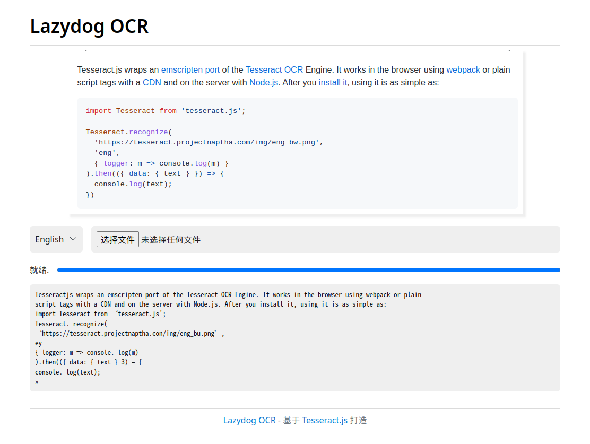

日常开发中，我们经常会拿到一个测试同学反馈的截图，圈上了有问题的部分，需要你来排查问题。
你看得到图片上有traceid和JSON入参，但是没有复制给你。你去找他复现，又得折腾人家重新给你抓信息。

此时使用苹果的同学就跳出来了，可以直接 OCR 图片上的文字出来。

如果没有苹果怎么办呢？我搜了一下，找到了 Tesseract 这个神奇的库，并把他包装成了一个在线网站。

最后的成品就是这样的



提前说明，这种开源的纯离线 OCR 没有大厂提供的付费 OCR 接口效果好，胜在一不用付费，二不用上传，全靠本机的算力进行识别。

<!--more-->

想体验的可以直接访问 [Lazydog OCR](https://ocr.zjyl1994.com) 。（名字的意思是懒狗，毕竟谁不想偷懒呢）

# 使用

1. 打开网站
1. 选择图片文件 / Ctrl + V 粘贴 / 拖拽图片
1. 等待加载 Tesseract 核心
1. 得到识别结果

是不是很简单？如果你只想在线识别的话，到这里就可以了。

# 技术细节

`Tesseract.js` 是开源的识别方案，刚刚迭代到3.0，提高了识别速度。但是官网给的例子还是 2.0 时代的，速度奇慢，几乎不可用。

3.0使用了WASM，还有SIMD的加持，速度就非常的快。为了能私有化部署，我把所有的 CDN 资源拉下放到代码仓库，所以使用的时候直接部署代码仓库即可。

核心功能就是这样的：

```javascript
// 感知是否支持 SIMD
simdSupported = await wasmFeatureDetect.simd();
// 识别核心
Tesseract.recognize(
    document.getElementById("imgbox"), // 输入一个img、canvas或者其他什么有图片的元素
    'eng', // 使用的识别模型，参考 https://github.com/naptha/tessdata/tree/gh-pages/4.0.0 中的内容 
    {
        workerPath: '/assets/core/worker.min.js', // 加载的 worker位置
        // 识别的核心，根据 SIMD 支持选择核心
        corePath: this.simdSupported ? '/assets/core/tesseract-core-simd.wasm.js' : '/assets/core/tesseract-core.wasm.js',
        langPath: '/assets/lang-data', // 存放识别模型的路径
        logger: m => {
            this.progressStatus = m.status; // m.status 识别的进度文本
            this.progressValue = Math.ceil(m.progress * 100); // m.progress 是 0-1 的浮点型进度
        }
    }
).then(({ data: { text } }) => {
    this.outputResult = text; // 最后输出的识别结果就是 text
    this.progressStatus = '就绪.';
});
```

想增加识别的语言，下载对应的训练数据放到 `lang-data` ，在语言字符串的位置传入对应的语言代码即可。

训练数据可以在 `https://github.com/naptha/tessdata` 下载。

整个项目已开源：`https://github.com/zjyl1994/lazydogocr`