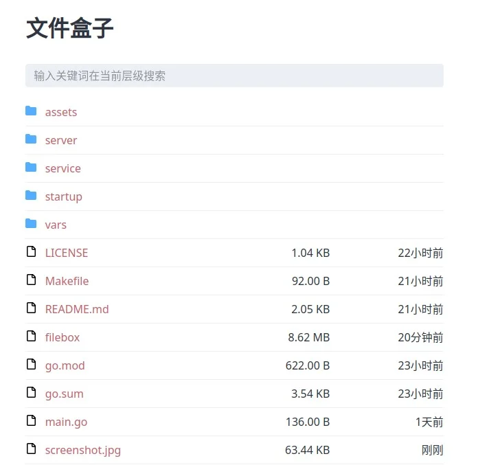
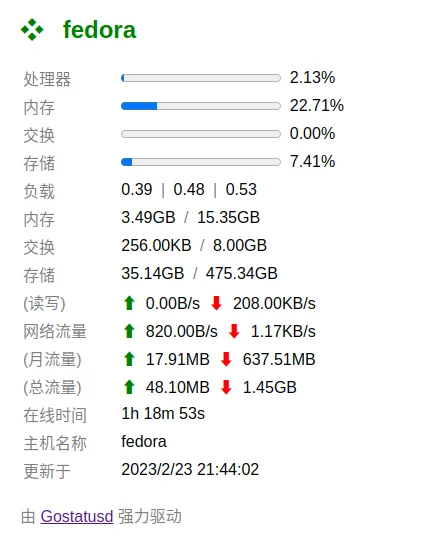

> 最近搞了两个小玩具，解决了我的一些问题。
能根据自己的需求定制工具，是最幸福的。

# 文件盒子

- 支持通过 WebUI 列出文件
- 文件的编辑操作通过 WebDAV 进行
- WebUI 可以隐藏文件
- WebDAV 可以设置密码
- Golang 单文件部署无额外依赖
- 实测可以部署在 Cloudflare CDN 后面
- 文件链接支持过期，防止迅雷等下载工具刷爆服务期流量
- 很轻量，实际占用约为 10M
- UPX 压缩完毕后 2.5MB

这一款工具主要是为了解决之前 Webls 项目需要 ssh 到服务器的问题。
现在可以通过 WebDAV 在手机/电脑等设备上直接修改文件。

# 简易信息面板

- 支持月流量统计
- 单文件无依赖部署
- 很轻量，实际内存占用约 11MB
- UPX 压缩后二进制为 5.7MB
- 后台持续采集数据，不会阻塞刷新

这一款工具是一个简单地探针应用，没有一些花哨的功能。
目前大部分探针都是PHP的，由于服务器没有PHP环境，所以想看一些信息还是比较麻烦的。简单地升级了一下多年以前的 Gostatusd 项目，配上了新的 UI 就这样了。

<!--more-->

可以在这里查看详情：

[https://github.com/zjyl1994/filebox](https://github.com/zjyl1994/filebox)

[https://github.com/zjyl1994/gostatusd](https://github.com/zjyl1994/gostatusd)

如果好用请给 star。

未来我会发掘更多的需求然后满足自己~