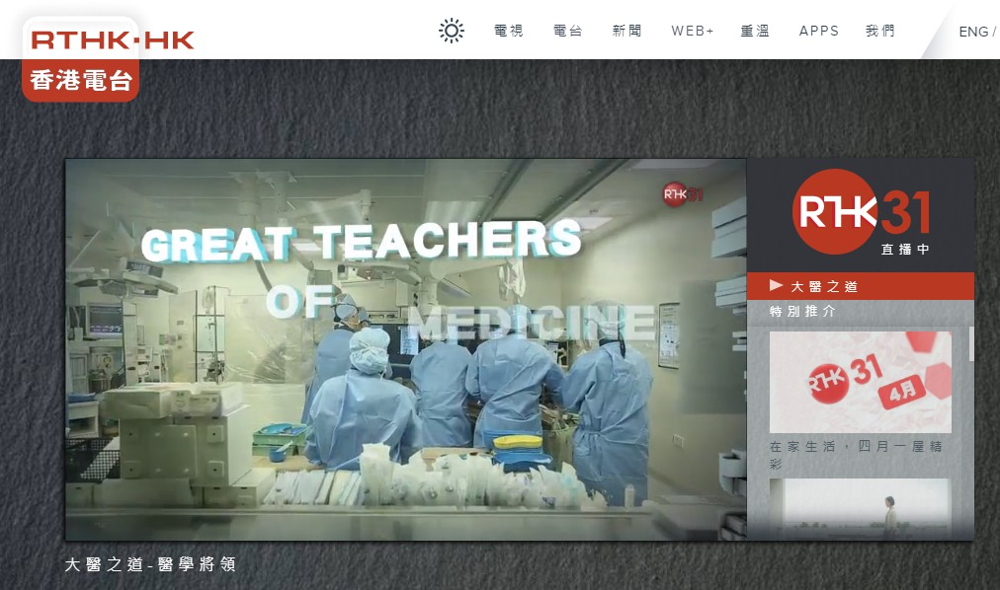
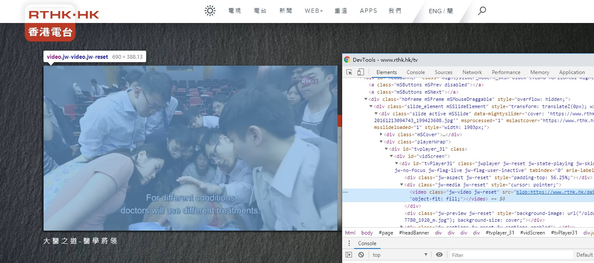
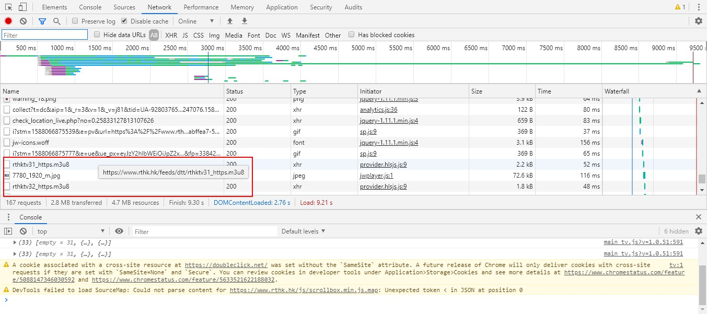
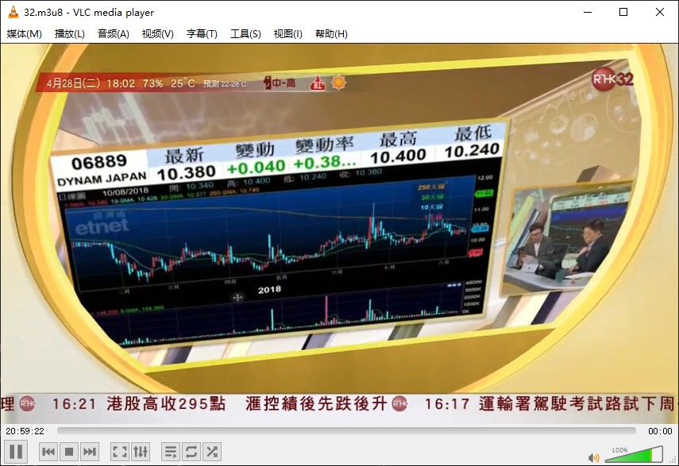

> 网上提供直播源的香港电视台除了TVB还有RTHK。

RTHK 是香港唯一的公营电视机构，有31和32两个免费电视台，而且最重要的是他们都提供了线上直播。

官方的播放地址是 [https://www.rthk.hk/tv](https://www.rthk.hk/tv)



<!--more-->

按下 <kbd>F12</kbd> 可以看到视频使用的是jwplayer播放，指向一个内存blob。



所以，我们需要转去 Network 标签查看所有网络流量。



尝试直接访问以下：`curl -s https://www.rthk.hk/feeds/dtt/rthktv31_https.m3u8`

会得到如下输出：

```m3u8
#EXTM3U
#EXT-X-STREAM-INF:PROGRAM-ID=1,BANDWIDTH=344000,RESOLUTION=256x144,CODECS="avc1.66.30, mp4a.40.2"
https://rthklive1-lh.akamaihd.net/i/rthk31_1@167495/index_216_av-p.m3u8?sd=10&rebase=on
#EXT-X-STREAM-INF:PROGRAM-ID=1,BANDWIDTH=344000,RESOLUTION=256x144,CODECS="avc1.66.30, mp4a.40.2"
https://rthklive1-lh.akamaihd.net/i/rthk31_1@167495/index_216_av-b.m3u8?sd=10&rebase=on
#EXT-X-STREAM-INF:PROGRAM-ID=1,BANDWIDTH=560000,RESOLUTION=432x240,CODECS="avc1.66.30, mp4a.40.2"
https://rthklive1-lh.akamaihd.net/i/rthk31_1@167495/index_432_av-p.m3u8?sd=10&rebase=on
#EXT-X-STREAM-INF:PROGRAM-ID=1,BANDWIDTH=560000,RESOLUTION=432x240,CODECS="avc1.66.30, mp4a.40.2"
https://rthklive1-lh.akamaihd.net/i/rthk31_1@167495/index_432_av-b.m3u8?sd=10&rebase=on
#EXT-X-STREAM-INF:PROGRAM-ID=1,BANDWIDTH=938000,RESOLUTION=640x360,CODECS="avc1.66.30, mp4a.40.2"
https://rthklive1-lh.akamaihd.net/i/rthk31_1@167495/index_810_av-p.m3u8?sd=10&rebase=on
#EXT-X-STREAM-INF:PROGRAM-ID=1,BANDWIDTH=938000,RESOLUTION=640x360,CODECS="avc1.66.30, mp4a.40.2"
https://rthklive1-lh.akamaihd.net/i/rthk31_1@167495/index_810_av-b.m3u8?sd=10&rebase=on
#EXT-X-STREAM-INF:PROGRAM-ID=1,BANDWIDTH=1424000,RESOLUTION=848x480,CODECS="avc1.66.30, mp4a.40.2"
https://rthklive1-lh.akamaihd.net/i/rthk31_1@167495/index_1296_av-p.m3u8?sd=10&rebase=on
#EXT-X-STREAM-INF:PROGRAM-ID=1,BANDWIDTH=1424000,RESOLUTION=848x480,CODECS="avc1.66.30, mp4a.40.2"
https://rthklive1-lh.akamaihd.net/i/rthk31_1@167495/index_1296_av-b.m3u8?sd=10&rebase=on
#EXT-X-STREAM-INF:PROGRAM-ID=1,BANDWIDTH=2180000,RESOLUTION=1280x720,CODECS="avc1.66.30, mp4a.40.2"
https://rthklive1-lh.akamaihd.net/i/rthk31_1@167495/index_2052_av-p.m3u8?sd=10&rebase=on
#EXT-X-STREAM-INF:PROGRAM-ID=1,BANDWIDTH=2180000,RESOLUTION=1280x720,CODECS="avc1.66.30, mp4a.40.2"
https://rthklive1-lh.akamaihd.net/i/rthk31_1@167495/index_2052_av-b.m3u8?sd=10&rebase=on
```

当然，你直接拿着这个想像TVB那样直接302是不行的。因为 `akamaihd.net` 整个在中国大陆不可用，所以说需要代理一下。

这就涉及到了HLS的基本知识，有需要的可以去了解以下。这里需要知道的是，M3U8只是播放清单，真正负责播放的是ts文件。所以代理分为两步，获取真实M3U8内容，然后代理ts文件。

刚才我们获取到的M3U8文件是MasterPlaylist，负责提供多种解析度的。在这里我们选择清晰度最高的 `https://rthklive1-lh.akamaihd.net/i/rthk31_1@167495/index_2052_av-p.m3u8?sd=10&rebase=on` 进行代理。(根据搜索，这个地址早在18年就有人解析出来了，一直没有变，可见十分稳定。只不过因为akamaihd全线被墙，不能播放)

利用curl可以查看到以下内容:

```m3u8
#EXTM3U
#EXT-X-TARGETDURATION:10
#EXT-X-ALLOW-CACHE:YES
#EXT-X-VERSION:3
#EXT-X-MEDIA-SEQUENCE:20055342
#EXTINF:10.000,
https://rthklive1-lh.akamaihd.net/i/rthk31_1@167495/segment20055342_2052_av-p.ts?sd=10
#EXTINF:10.000,
https://rthklive1-lh.akamaihd.net/i/rthk31_1@167495/segment20055343_2052_av-p.ts?sd=10
#EXTINF:10.000,
https://rthklive1-lh.akamaihd.net/i/rthk31_1@167495/segment20055344_2052_av-p.ts?sd=10
```

我们要做的就是去代理ts文件，并且把M3U8中的地址换成我们自己的代理地址。

首先需要搞一个ts代理，很简单。

```go
func tsProxyHandler(c *gin.Context) {
	remoteUrl := c.Query("url")
	resp, err := http.Get(remoteUrl)
	if err != nil {
		c.AbortWithError(500, err)
		return
	}
	defer resp.Body.Close()
	c.DataFromReader(200, resp.ContentLength, resp.Header.Get("Content-Type"), resp.Body, nil)
}
```

就是简单的获取参数，然后去读取数据，记住要原样传递 `content-type`，正确传输body，其他不重要。

然后，我们来编写M3U8的代理。
M3U8文件是纯文本文件，所有控制信息以 `#` 开头，所以可以写一个逐行操作的程序，替换掉非 `#` 开头的URL。
基本代码如下:

```go
func m3u8ProxyHandler(m3u8url string, c *gin.Context) {
	resp, err := getHttpClient().Get(m3u8url)
	if err != nil {
		c.AbortWithError(500, err)
		return
	}
	defer resp.Body.Close()
	bodyBytes, err := ioutil.ReadAll(resp.Body)
	if err != nil {
		c.AbortWithError(500, err)
		return
	}
	bodyString := string(bodyBytes)
	processedBody := m3u8Proc(bodyString, baseURL+"i.ts?url=")
	c.Data(200, resp.Header.Get("Content-Type"), []byte(processedBody))
}

func m3u8Proc(data string, prefixUrl string) string {
	var sb strings.Builder
	scanner := bufio.NewScanner(strings.NewReader(data))
	for scanner.Scan() {
		l := scanner.Text()
		if strings.HasPrefix(l, "#") {
			sb.WriteString(l)
		} else {
			sb.WriteString(prefixUrl)
			sb.WriteString(url.QueryEscape(l))
		}
		sb.WriteString("\n")
	}
	return sb.String()
}
```

然后就是很简单的组装环节了，要注意的是，VLC 播放器非常吃后缀名这个设定。所以TS文件必须`.ts`结尾。要不然他会在日志里默默的打上一句"Nothing to play"，然后装傻不去播放。

最后的效果如下：



相关的代理我已经封装成库了，可以参看 [https://github.com/zjyl1994/tvproxy](https://github.com/zjyl1994/tvproxy) ,觉得好用给个star啦。