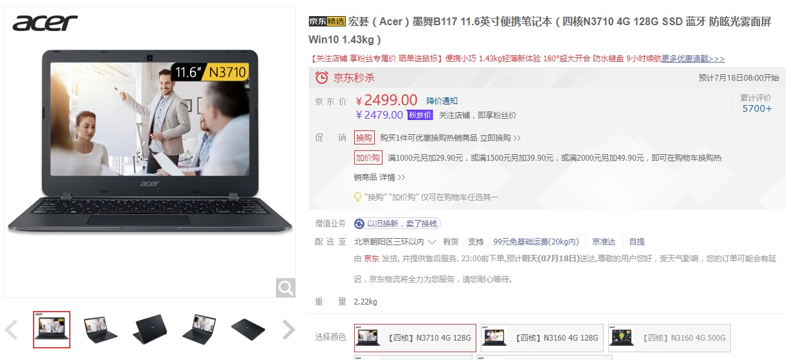

> 2018-07-17夜 深圳 狂风暴雨配闪电

# 前言

买了个摸鱼用的笔记本，宏碁TravelMate B117，使用体验还挺好。

我的需求很简单：

1. 能运行Manjaro
2. 电池耐用
3. 尺寸小
4. 便宜

选来选去就选到了这个笔记本。基本配置是这样的：

- Intel 奔腾 N3710 处理器
- 4GB 内存 / 128GB 闪存
- 11.6英寸1366*768屏幕

最重要的是：这个本子我买的时候特价只要2399，现在2499也不是很贵。



<!--more-->

购买链接：https://item.jd.com/3119258.html


搭配的45W充电器，内置48Wh电池，充电速度还算可以。


PS：这个指示灯在电脑合盖休眠时会呼吸闪烁，不过并没有多烦人。

PS2：这个电脑无风扇的！而且是固态的！也就是说，没噪音！

PS3：N3710自带AES-NI加持。（Intel的硬件AES加速方案）

PS4：Intel自己家的蓝牙无线方案，Linux免驱。

PSP：没有显卡，Intel核显，Linux免驱。

# 配置环境

## 安装Manjaro

买这个本子最重要的用途就是使用实体机安装Manjaro了，首先先去下载XFCE版的Manjaro。

下载完Manjaro的ISO镜像后，需要使用Rufus的DD模式进行U盘制作。

由于这个电脑预装了一个WIndows10家庭版，所以先要把它请出去。首先需要去Win10里重启电脑到UEFI设置界面，然后关闭UEFI的SecureBoot功能。这样才能在UEFI模式下启动Manjaro安装程序。

**注意：**默认情况下是不给你操作SecureBoot的选项的，默认Enabled。你需要设置Supervisor Password之后才可以激活SecureBoot选项。如果怕忘了密码可以选择关闭SecureBoot后再取消Supervisor Password。（设置的时候新密码和确认新密码直接回车就是取消）

安装过程不再赘述，网上有不少Manjaro安装教程。相比ArchLinux本身，Manjaro有自己的图形化安装界面简单太多了。要注意，N3710这颗处理器居然是有AES-NI加持的，也就是说加密性能会有Intel的定向优化加持。所以说全盘加密等特性想开就开，不用担心影响性能。

日常使用情况，4GB内存占用1.3G左右，主要是浏览器。开机通过free命令查看内存消耗，大约350MB左右。（XFCE环境）

## 安装基本开发工具

我这个本子主要做golang开发，所以说golang环境和vscode是必不可少的。由于这个电脑CPU的孱弱性能，不建议上来就用Goland之类的巨型IDE，这种IDE还是在正规的台式开发机上使用为好。

- 安装Go环境  `pacman -S go`
- 安装Yaourt `pacman -S yaourt`
- 安装Vscode `yaourt visual studio code binary` 选第一个aur上的包就可以了

## 安装Fcitx

中文输入法很烦人，我也是折腾到现在才把输入法搞定。

首先要装一堆输入法的依赖：

```bash
pacman -S fcitx fcitx-configtool fcitx-qt4 fcitx-qt5 fcitx-gtk2 fcitx-gtk3
```

然后根据你的喜好安装对应的输入法，我个人比较喜欢sunpinyin，这是早年用Ubuntu养成的习惯。

```bash
pacman -S fcitx-sunpinyin
```

重启之后，你就可以使用<kbd>Ctrl</kbd> + <kbd>space</kbd>激活输入法了。

## 配置代理

大陆程序员都懂这步该怎么搞。

我只想提醒一点，你需要把`HTTP_PROXY` 、`HTTPS_PROXY`、 `http_proxy`、 `https_proxy` 都给设置上。有的应用吃大写，有的应用吃小写，xfce并没有提供统一设置的地方。

# 总结

宏碁的这款TravelMate B117适合于作为开发备用机使用，用来开发和测试一些需要真机Linux支持的应用，便宜够用，这就够了。

官方声称拥有防泼溅键盘，但日常生活中还是不要让它沾水。

机器本身自带AES-NI，全盘加密的应用场景不会太慢。

不俗的电池使用时间，日常打打代码测试一下离了电源也能坚持5h以上。（这还是代码开了自动提示，后台程序总在那扫来扫去的成绩。Windows用户可以参考官方给的9h续航时间）

性能上，如果你会折腾电脑有信心保证不被全家桶占领的话，这个电脑还是可以做一些日常应用的。打个字上个网完全无压力。

无风扇，固态硬盘，噪声近乎于0，你晚上在屋里写东西也不会很吵。

最主要的是便宜，2399就能买到正规老牌笔记本厂商出品的真正x86电脑，而且做工对得起售价，手感不错。

毕竟，2399要什么自行车。（N3160处理器 + 32GB闪存版本最低能卖到1799，和手机差不多价了）

