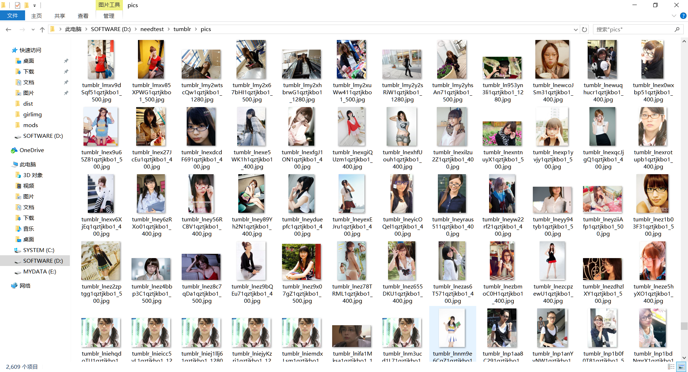

> Tumblr是个好东西，上面有很多漂亮小姐姐。

在Tumblr的海洋里遨游，总会有几个对胃口的博客。如果你想下载里面的图片，应该怎么下呢？
普通人肯定是手动一张一张另存为啦。但是你要知道有的博客里会有几千张甚至几万张照片哦，你不会想一个一个手动来吧。 XD

这个时候就要请出Python了！

Python不用我过多介绍了吧，就是一个编程语言。嗯，这个东西很简单，要学的话教程网上很多，有英文基础就可以了（其实关键词就那几个，不会英文也能学啦。

要爬Tumblr的图片，首先要知道Tumblr的图片地址，正常来说需要我们解析网页然后抓取HTML中的jpg路径。但是，Tumblr这个好心的家伙居然给了API！

<!--more-->

它的API分为两个版本，V2需要注册，功能更多。但是V1并不需要注册，只需要在Tumblr的地址后面加上/api/read就可以获取到XML格式的信息了。给你们看一下他输出的XML：

1. 

就是这样，你要的图片路径都有，还有很多附加信息。

拿到了XML文档，我们就该想一下怎么解析了，首先要了解一下什么是XPath。

XPath是一种用来访问XML节点信息的描述语言，可以根据你的需要找到所有数据。算是一种小小的DSL，具体内容可以谷歌，或者去Bing搜一下。

在这个程序里我用到了4条XPath，分别是：

1. /tumblr/posts/@start
2. /tumblr/posts/@total
3. /tumblr/posts/post/photoset/photo[*]/photo-url[1]/text()
4. /tumblr/posts/post/photo-url[1]/text()

通过查看XML结构我们得知，tumblr节点下的posts有两个属性，start和total，这两个查看API文档可以知道是翻页查询时使用的参数，所以分别用1、2提取。

然后可以观察图片的路径，可以看到位于post节点下的photo-url节点中，这时候使用photo-url[1]就可以提取结果集中的第一项了。至于为什么只要第一个photo-url？那是因为别的都是小分辨率的，只有第一个是分辨率最大的那个。所以说我们有了第4个xpath，至于为什么有第3个xpath，观察某些多图片博客的xml可以看到他有个photoset在外面，所以我们用3把它也兼容掉。

通过3、4拿到对应的文件路径之后我们就可以下载了，要注意34的结果集要做一次去重，防止匹配到同一张图片哦，剩下的用Python3自带的urllib下载就行了。

下面是完整代码：

```python
#!/usr/bin/env python3
import os
import json
import requests
import urllib
from lxml import etree
# 配置信息
tumblrUsername = "megane-megane-megane" # 你想下载的Tumblr博客用户名
saveToPath = "D:/needtest/tumblr/pics" # 下载到的文件夹路径
# 程序本体
postOffset = 0
total = 1
while postOffset < total:
    baseUrl = "https://%s.tumblr.com/api/read?type=photo&filter=text&num=50&start=%s" % (tumblrUsername,postOffset)
    response = requests.get(baseUrl)
    xml = etree.fromstring(response.content)
    start = int(xml.xpath('/tumblr/posts/@start')[0])    # 起始条目
    total = int(xml.xpath('/tumblr/posts/@total')[0])    # 总条目
    print("[%s]%d/%d" % (tumblrUsername,start,total))
    picList = xml.xpath('/tumblr/posts/post/photoset/photo[*]/photo-url[1]/text()')
    picList.extend(xml.xpath('/tumblr/posts/post/photo-url[1]/text()'))
    postOffset = start + 50
    picList = list(set(picList))
    for pic in picList:
        filename = os.path.join(saveToPath,os.path.basename(pic))
        print(pic)
        try:
            urllib.request.urlretrieve(pic,filename)
        except urllib.error.HTTPError as e:
            print(e)
```

这是运行效果图：




这算是简易版的了，下载速度慢可以通过多线程来解决，不过这样的话就不止30行了，有能力可以自己动手改造一下。