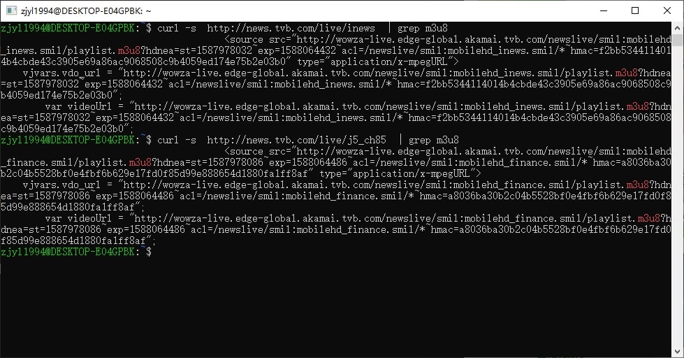
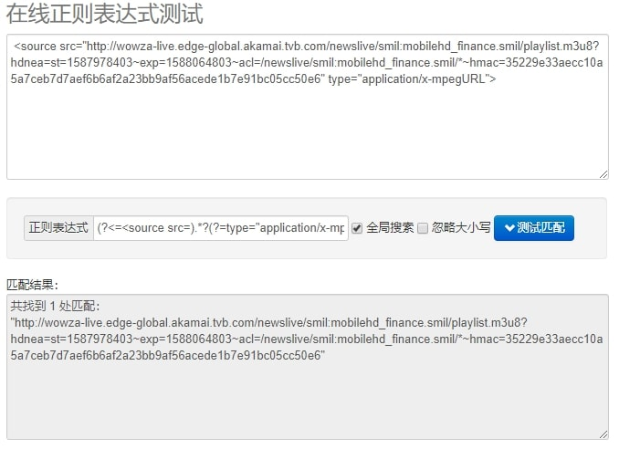
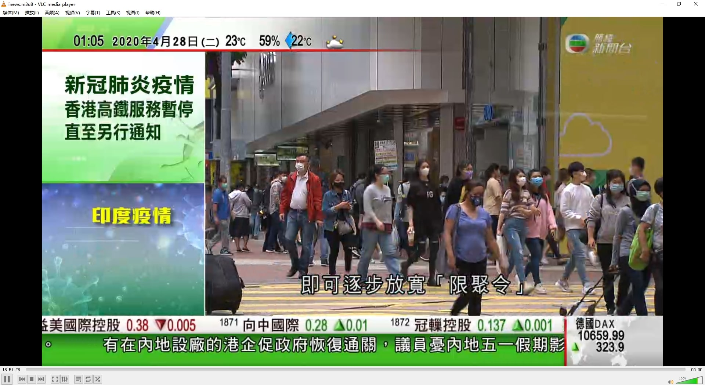

> 找工作期间闲的无聊想看电视，买了一部NUC作为播放设备，但是没有合适的电视直播源，只能自己动手了。

TVB无线新闻台 的直播地址是 [http://news.tvb.com/live/inews](http://news.tvb.com/live/inews)

TVB无线财经资讯台 的地址是 [http://news.tvb.com/live/j5_ch85](http://news.tvb.com/live/j5_ch85)


当然这两个直接用网页打开就能看，但是我想在 Kodi 上播放，所以还要处理一下。

<!--more-->

先检查一下源码，一般来说直播都是M3U8格式的，所以在源码里搜以下m3u8可能会有惊喜。



可以看见，TVB的地址基本没有做特殊处理，只是带了一些控制参数，比如exp看起来就像是过期时间，hmac可能是签名，防止你自己生成这个url的。如果直接使用这个地址进行播放，可能过一阵就会打不开了，因为他们做了过期处理。

所以就需要写一个程序专门提取这个地址，我选择了最熟悉的 Golang。

可以看出来，最重要的URL部分被包裹在 `<source src="` 和 `" type="application/x-mpegURL">` 中，所以我们可以写一个正则来直接提取这个URL。

随手写了一个正则:`(?<=<source src=).*?(?=type="application/x-mpegURL">)`

让我们测试一下:



拿到对应的播放URL之后就很简单了，只要起一个HTTP服务器，收到播放请求的时候，用302把播放器跳去官方的播放CDN即可。中间不需要你服务器做什么转发视频流的操作，基本消耗就是一次几KB？

Golang版代码如下:

```go
func parseTVB(liveName string) (string, error) {
	resp, err := http.Get("http://news.tvb.com/live/" + liveName)
	if err != nil {
		return "", err
	}
	defer resp.Body.Close()
	bBody, err := ioutil.ReadAll(resp.Body)
	if err != nil {
		return "", err
	}
	m3u8Regexp := regexp.MustCompile(`<source src="(.*?)" type="application/x-mpegURL">`)
	match := m3u8Regexp.FindStringSubmatch(string(bBody))
	if len(match) > 1 {
		return match[1], nil
	} else {
		return "", nil
	}
}
```

这是最基本的 HTTP GET 请求 + 正则运用，没有什么好说的。

经过简单的包装，(代码可以看: [https://github.com/zjyl1994/tvproxy](https://github.com/zjyl1994/tvproxy) )

我们来测试一下:



可以看到播放的很好。

可惜 `akamaihd.net` 被墙了，要不然还可以搞一个 RTHK 的直播源。