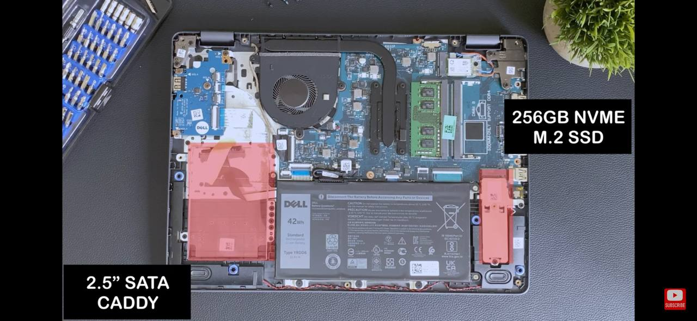

> 赶上京东做活动以旧换新，处理了家里的老电脑和吃灰手机。

我的主力电脑是 联想小新Pro 13 2020 锐龙版本，由于工作离不开真实的 Windows 环境，我的 Linux 开发都被迫挤到18年那部 TMB117 小笔记本上。
很难想象一部18年的赛扬老机器是如何顶着无风扇的降频硬抗开发任务的，在京东看到活动之后就萌生了换机的想法。

考虑到有一块从下载机上拆下来的闲置大容量SSD硬盘，可选电脑范围就被限制的很窄了，毕竟2022年想找到还有SATA盘位的新笔记本非常难找。
考虑到兼容性、SATA、性能等，最后圈定了 Dell Vostro 3400 i5-1135G7+16G内存+512G固态版本，京东当时的活动价 3599。

选择理由：
1. 11代i5 性能保障。（12代i5有大小核设计，按照日常Linux经验，这种新技术头几年体验会很差）
2. SATA盘位预留并且有线和安装架无需额外购买（Acer的EX215有预留HDD空间但是排线和架都要另外购买，而且没有提供购买渠道）
3. Ubuntu 认证机型，意味着大部分软件功能都应该是好使的，如果不能用可以去Ubuntu里抓驱动过来。

<!--more-->

# 拆机

拿到新机，使用 Fedora LiveUSB 进行验证，确定基础功能 OK 后开始拆机。
选择合适尺寸的十字螺丝刀，拧掉后盖能看到的所有螺丝。**注意，靠近屏轴一侧最外的两颗螺丝无法取下，内部有垫片。** 确定完全松开后请用硬质卡片或者拆机使用的撬棒依次打开卡扣，卸下D面。



此图片来自互联网，可以看到2.5寸硬盘空间上有框架和排线预留，这也是我购买的重要因素之一。

有一个小细节，为了防止你买不到那么小的螺丝，直接在硬盘框架上拧了4颗固定用的螺丝留给你。DELL 过于贴心。


安装好框架插好排线就可以正常使用了。

# Fedora 之旅

最早的 Linux 体验是 TMB117 上 Manjaro+XFCE 的经典组合。考虑到性能变好了，可以愉快的 KDE，于是选择了最新出的 Fedora 36 KDE 版本。

装好之后的成品是这样的：


（KDE自带的截图就带一圈黑边，估计是窗口管理器加的特效没法被截取下来吧。）

最新的 Fedora 36 已经全面转向 Wayland 了，所以 `screenfetch` 也没法取到分辨率。不过我可以告诉你这部机是14寸1080p屏幕非IPS，能用，但不会很惊艳。
和小新Pro13那块2.5K的IPS屏幕没得比，但是日常使用看个电影啥的完全OK。

# 折腾笔记

## 更换软件源

官方软件源里偶尔会抽到东软的源，dnf经常报错，我一度怀疑是我的操作有问题。
后来经过专家指点是最快源抽到的 Neusoft 镜像有问题。

大名鼎鼎的TUNA源自然是最好的选择，不过听说负载过高，所以我选择换成BFSU的源。

换源教程：https://mirrors.bfsu.edu.cn/help/fedora/

## 安装常见小工具

```bash
sudo dnf install htop screenfetch lm_sensors netcat
```

## 安装 fcitx 替换 ibus

```bash
sudo dnf install fcitx5 fcitx5-configtool fcitx5-gtk fcitx5-autostart fcitx5-qt fcitx5-chinese-addons  fcitx5-data kcm-fcitx5
```

然后KDE主菜单搜索 `输入法选择器`，启用fcitx5并重启生效。

## 开启 Intel 硬解

```bash
# 安装 rpmfusion 软件源获取额外支持
sudo dnf install https://mirrors.rpmfusion.org/free/fedora/rpmfusion-free-release-$(rpm -E %fedora).noarch.rpm https://mirrors.rpmfusion.org/nonfree/fedora/rpmfusion-nonfree-release-$(rpm -E %fedora).noarch.rpm
# 安装 Intel 媒体驱动
sudo dnf install libva libva-utils libva-intel-driver intel-media-driver ffmpeg
```

此刻你的系统就该支持 Intel 核显硬解视频了，Iris Xe 的显卡游戏性能不好说，看视频还是完全 OK 的。

## 支持 THETIS 的 FIDO2 Key

```bash
# 此段来自 Thetis 的官网说明
echo 'KERNEL=="hidraw*", SUBSYSTEM=="hidraw", MODE="0664", GROUP="plugdev"' | sudo tee /etc/udev/rules.d/thetisu2f.rules
sudo udevadm control --reload-rules
```

## 日常空载占用率过高，packagekit导致关机卡顿

如果发现日常使用中风扇狂转，大概率是你加了海外的软件源，然后packagekit在疯狂的拉取更新信息又被RST反复重试导致的。

如何验证呢？如果你的电脑风扇此时正在原地起飞电脑热到爆炸，立刻重启。

在Fedora转圈圈出现时按 <kbd>Esc</kbd>

你会发现整个系统在等待 `packagekit` 读秒，那大概率就是他的问题了。

可以通过 `sudo systemctl mask packagekit` 屏蔽该服务，重启后即可生效。

已知的影响点：Discover 软件商店的更新会挂掉，不过不影响你正常 `dnf update` 之类的手动更新方法，只是以后没有人提示你软件包需要更新了而已。

## 配置 Github 代理

由于众所周知的原因 Github SSH 基本连不上。
于是需要编辑`~/.ssh/config`增加以下段：
```
Host github.com
    ProxyCommand /usr/bin/netcat -x 127.0.0.1:20170 %h %p
```
其实这一段也是网上复制来的，最重要的问题是：Fedora自带的nc不是netcat,需要手动装了然后修改这里面调用的命令。

其中，20170的端口号需要改成你自己的端口号。

# 后记

这部机器被我调教了一个星期不到，基本已经满足我的需求了，通过 Ubuntu 认证的机型对Linux友好程度非常棒，Fedora上适配的也很好，基本免驱动所有功能都OK,包括快捷键。

这部机会作为我的纯 Linux 环境开发使用，这配置应该可以支撑很久了。