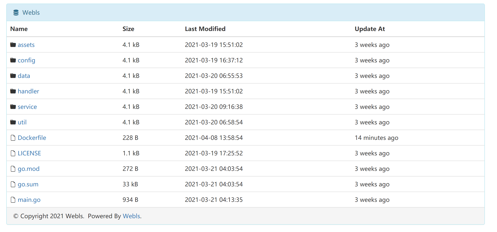
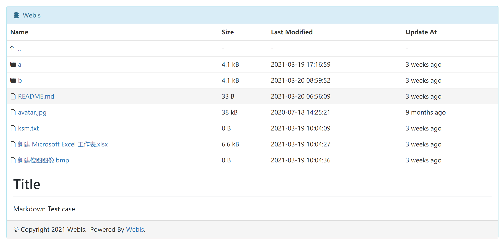
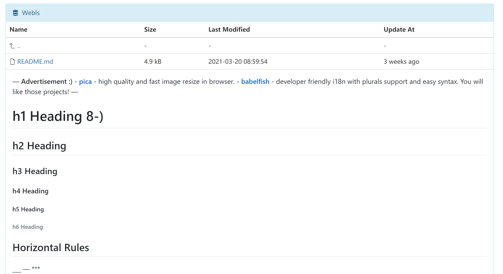
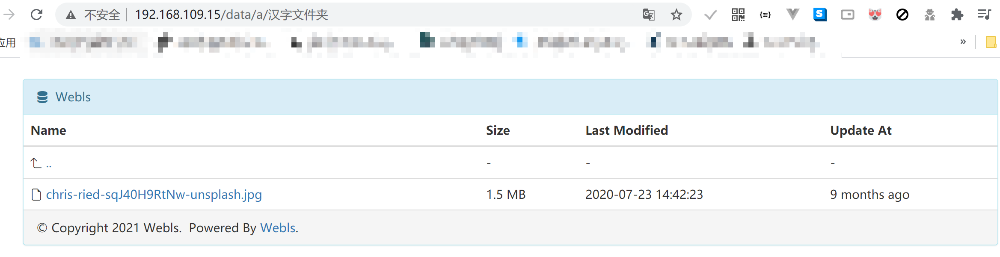

> 正好有个工具文件上云的需求，就做了这么个工具。

最近有一个文件扔到服务器上的需求，简简单单用 Golang 糊了一个文件列出工具。

成品是这样的

还可以支持 Markdown 展示

<!--more-->

只要你的文件夹中有`README.md`文件，就能渲染出来对应的文件内容。

而且使用了 GitHub 风格的渲染器，所以可以支持多种样式

而且支持中文的路径

对于带有点的文件和文件夹，和 unix 系列的行为一致，会被隐藏起来。

项目地址: https://github.com/zjyl1994/webls

使用方法很简单，把编译好的 webls 文件扔到你需要的地方就可以运行了。

运行后可以在 9496 端口上得到同款界面。同时我还制作了 docker镜像 可以使用。