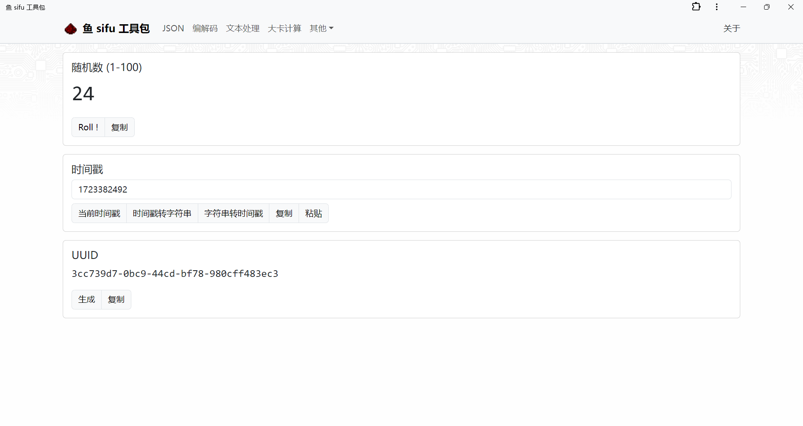
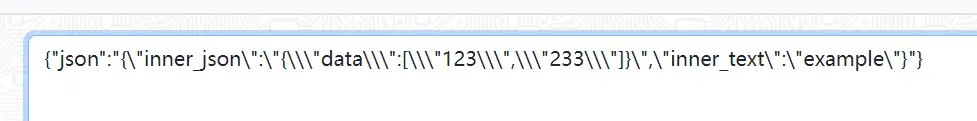
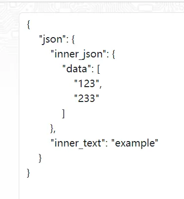
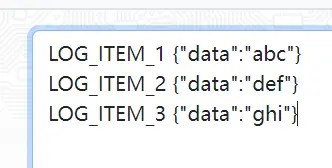
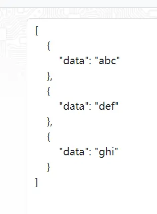
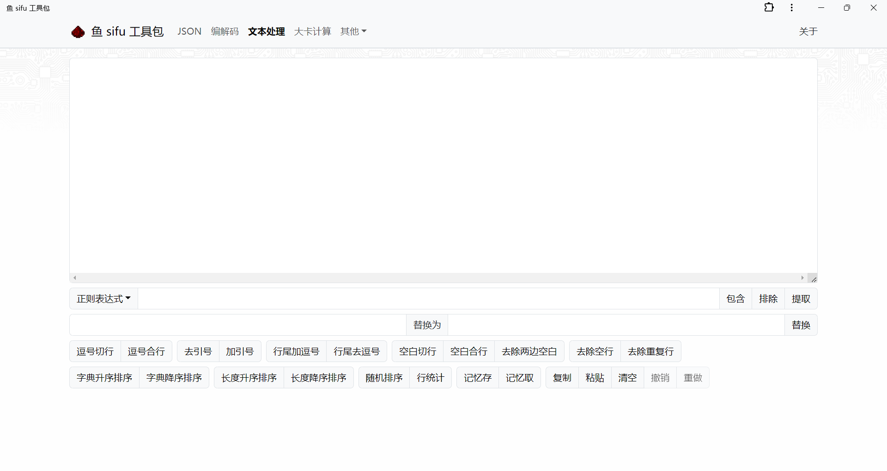
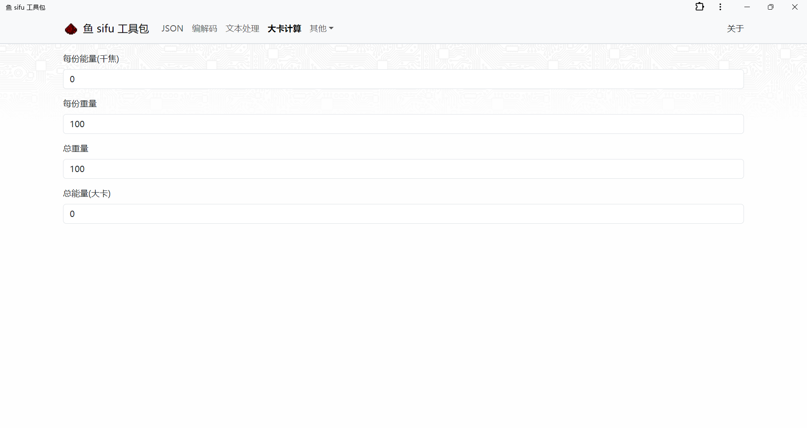

最近一直在忙公司的项目，经常和 JSON，日志系统中输出的文本，excel文件打交道。
所以有不少重复劳动需要弄，比如查看一下 JSON 文本中嵌套的JSON什么的。

所以借着这个机会把我的早期工具站用 React 重构了，增加了 PWA 技术，现在可以安装到电脑里当WebApp使用，除了整合常用的开发功能，最主要是打开快，All in One。

由于没有好的设计，所以沿用了之前老工具站（已下线）的 Bootstrap5。

<!--more-->

# 首页功能
先看看首页功能：

我在首页放了比较常用的随机数，时间戳和 UUID 生成。这些都是纯离线的，无需服务器介入。

# JSON处理
接下来有一个比较好用的工具了：

格式化，压缩，转义去转义这些都是传统 JSON 在线工具常见的功能。

比较特色的是"增强格式化"，日常开发中经常遇到 JSON 嵌套 JSON 这种情况，如果比较多的话，一条条人工解析会非常难受，
用增强格式化会尝试解析字符串，如果是 JSON 的话就会嵌套展开。

会被一键格式化成如下样子。

打印出来的日志里最喜欢 JSON 套 JSON 了，所以这是我相当满意的功能，日常使用频率也很高。

"智能处理"也是比较常用的功能，他会按照先单行再多行的顺序尝试去除文本两边的非JSON文本（TRIM），然后尝试格式化，也是处理日志的好帮手。

旁边的功能就是智能处理拆解后的功能了，可以手动处理更复杂的内容。

演示下"智能处理"

# 编码处理

这个没什么可说的，就是字面意思。八进制 UTF8 解码用于处理 Python 打印出来的 `\x123\x456\x789` 这样的中文，也是查看日志非常方便的功能。

# 文本处理

文本处理这个模块花的开发时间是最多的，也是根据日常使用不停迭代的结果，非常适合处理日常产生的多行文本。

正则表达式的输入框可以输入正则，根据正则过滤文本，每一行都会视作独立的内容进行处理。正则的"提取"功能输出格式是可以直接复制到 Excel 中的，不会挤在同一个单元格，这点我也做了特殊处理。（手边暂时没有合适的脱敏数据就不演示了，可以自行探索）

下面的替换框就是普通的文本替换，免去了离开去记事本做替换的麻烦。

按钮区的功能就是字面意思，常见的场景比如输出了一系列逗号分割的ID，需要在两边添加引号，生成 WHERE IN 那种格式贴到SQL里，只需要以下几步 `逗号切行 -> 加引号 -> 行尾加逗号`，然后少少的编辑一下就可以用了。

（虽然我知道文本编辑器有列编辑模式，但是体验下来还是特化成工具更方便一些）

# 大卡计算

减脂期非常有用的大卡计算，日常包装食物的"营养成分表"都是以千焦为单位，而且是每份热量。常见食品净含量折算后也不止一份，所以快速计算具体的大卡数量就比较有必要了。

这个功能也支持手机端打开，有了 PWA 加持缓存没过期的时候基本能做到秒开。

# 结语

那么，这么好用的工具站哪里可以使用到呢？

站点: https://utils.zjyl1994.com/

源码：https://github.com/zjyl1994/my-web-tools

喜欢的话可以给我 Star，
特别感谢 Rex Zeng 老师帮我优化了部分 React 的写法~